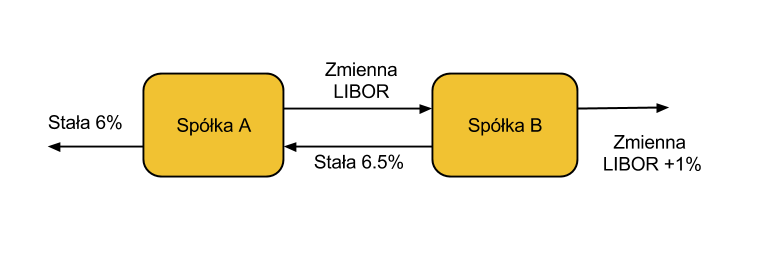

Instrumenty syntetyczne
=======================

Tak jak światło składa się z elementów składowych tak i instrumenty
finansowe składają się z instrumentów podstawowych. Jak już było
wspomniane to na początku rozdziału o opcjach, opcje należą do tych
składowych. Instrumenty syntetyczne to instrumenty składające (dające
się rozłożyć) na składowe instrumenty. Instrumenty syntetyczne
składają się z kombinacji dwu lub więcej elementów
składowych. Konstrukcja takich instrumentów nazywana jest inżynierią
finansową.

Oprócz opcji „cegiełkami” tworzącymi inne instrumenty są obligacje,
akcje, opcje call i put oraz swapy.

Na początek budujemy portfel inwestycyjny. Kupujemy aktywo i od
momentu posiadania aktywa obawiamy się spadku jego ceny i chcemy by
wartość naszego portfela nie zmalała w przypadku spadku cen tego
aktywa na rynku. Aby się zabezpieczyc przed spadkiem wartości portfela
kupujemy opcje put na wspomniane aktywo.  Kupienie opcji put i
zapłacenie premii pozwala na ograniczenie możliwych strat z dołu przy
zachowaniu szans na wzrost wartości aktywa. W takiej strategii widać
podobieństwo do płacenia polisy ubezpieczeniowej za ograniczenie
strat.

Ale widać strategie alternatywna dla opisanej sytuacji.  Zamiast
kupować aktywo i opcje put zapewniającą „atrakcyjna” cenę jego
sprzedaży możemy kupić jedynie opcje call na „atrakcyjną” cenę aktywa.
Zaoszczędzone pieniądze (różnica miedzy ceną kupna aktywa i premia
opcji put) możemy zainwestować w instrument dłużny oprocentowany stopa
wolna od ryzyka.  Jeśli wartość aktywa wzrośnie możemy kupić je
wykorzystując opcje call i swoją inwestycje. Jeśli wartość aktywa
spadnie można pozwolić wygasnąć opcji i zachować pieniądze w
inwestycji w stopę wolną od ryzyka.

Porównując obie strategie widzimy, że 

    ====================	========================	=================
    .				Wartość przy wygaśnięciu	.
    ====================	========================	=================
    pozycja początkowa		S < X				S :math:`\geq` X
    Akcje + Put			X				S
    Call + PV(E)		X				S
    ====================	========================	=================

Niech cena aktywa wynosi S a cena wykonania opcji X.  W zależności od
tego ile wynosi cena aktywa na rynku postępujemy:

w przypadku portfela:

Aktywo + Put

- Jeśli S < X, wykorzystaj put i weź X
- Jeśli S :math:`\geq` X, niech put wygaśnie a masz S

Portfel  Call + PV(X)

- PV(X) będzie warta X dla wygaśnięcia opcji 
- Jeśli S < X, niech call wygaśnie a masz inwestycje, X
- Jeśli S :math:`\geq` X, wykorzystaj call mając inwestycje i masz  S

Jeśli te dwie pozycje są tyle samo warte na koniec inwestycji to
powinny być tyle samo warte na początku inwestycji.

To prowadzi do warunku równości (parytetu) put-call 

.. math::
   :label: IS1

   S + P = C + PV(X)

Gdzie

 - :math:`S` - cena aktywa (1 akcji)
 - :math:`P` - cena opcji put (1 opcja) na cenę wykonania X i czasie
   do wygaśnięcia T
 - :math:`C` - cena opcji call (jedna opcja) na cene wykonania X i
   czasie do wygaśnięcia T – jak opcja put.
 - :math:`PV(X)` - jedna obligacja (instrument dyskontowy) z wartością
   w czasie zapadalności T równej X.

Możemy również rozumieć ten związek 

Jeśli ten warunek nie zachodzi to mamy do czynienia z arbitrażem.
Możliwość arbitrażu nie będzie istnieć długo ale wtedy opłacalnym
będzie działanie: Kup stronę „niską” a sprzedaj „wysoka”

Arbitraż jest sytuacją wyjątkową i ulotną w stosunku do sytuacji gdy
rynek jest w równowadze.  Jeśli rynek jest efektywny (a raczej jest)
używamy tego równania do znalezienia wielkości przy pomocy danych
pozostałych trzech instrumentów

.. admonition:: Przykład:

    Z danych rynkowych widać, że :

    Aktualna cena akcji = 50, cena opcji Put = 1.15, z ceną wykonania
    = 45, stopa wolna od ryzyka = 5%, Termin wygaśnięcia 1 rok

    Pytanie : Jaka jest cena  opcji Call?

    Korzystając z równania parytetu mamy 

    50  1.15 = C + 45 / (1.05)

    Czyli cena opcji call wynosi  C = 8.29. 

Przy wycenie opcji podobnie jak w wielu przypadkach instrumentów
dłużnych stosuje ciągłą kapitalizacje w czasie.

Równania wartości pieniądza w czasie dla ciągłej kapitalizacji:

.. math::

   PV = FVe^{-Rt} 

   FV = PVe^{Rt} 

Równanie pokazujące związek ceny akcji I opcji call oraz put I
obligacji o stopie bez ryzyka :eq:`IS1` wygląda:

.. math::

   S + P = C + Xe^{-Rt} 

Gdzie :math:`X` - to wartość obligacji na stopę wolna od ryzyka na datę
wygaśnięcia opcji. :math:`X` to również cena wykonania opcji (obu) w czasie
wygaśnięcia.

Jeśli aktywo (akcja) wypłaca dywidendę to zachodzi równość.

cena opcji Put - cena opcji Call  = present value ceny wykonania  + present value dywidend  - cena akcji 

Gdy na wykresie zysków (strat) od ceny aktywa naniesiemy zależności
dla ceny akcji opcji call I put możemy łatwo wykazać zależność
parytetu graficznie.

.. image

Oznaczenia:

| Zółty kolor – long call
| Czerwony  - long put
| Niebieski- pozycja długa w aktywie (akcja)
| Jasno niebieski przerywany – pozycja długa w obligacji.

Analogicznie aby określić cenę opcji put przekształcamy wzór :eq:`IS1`
do postaci:

.. math::
   :label: IS2

   P = C – S + Xe^{-Rt}

Dlaczego?  Kupienie call i sprzedaż aktywa (akcji) replikuje wypłatę z
zakupu opcji put.

A co w przypadku istnienia krótkiej sprzedaży??

Możemy pożyczyć obligacje (na stopie wolnej od ryzyka). odsetki
zarobione na pożyczonej obligacji (pozycja długa w obligacji) pozwolą
na taki sam dochód jak w przypadku kupienia put. Korzystając z prawa
jednej ceny tak skonstruowany portfel i opcja put musi mieć taka sama
wartość.

Graficznie przedstawia to wykres

.. image

Korzystając ze wzoru :eq:`IS1` możemy tworzyć instrumenty syntetyczne
korzystając z cztere „cegieł„ wymienionych powyżej.

Syntetyczna pozycja Long Stock można stworzyć syntetyczną pozycję
posiadania akcji poprzez kupienie call, sprzedaż put, i zainwestowanie
ceny wykonania na stopę wolna od ryzyka do wygaśnięcia.

.. math::

   S = C - P + Xe^{-Rt}

Graficznie  pokazuje to rysunek poniżej 

.. image

Long Call

Można zbudować pozycje syntetyczną long call poprzez kupienie Put,
kupienie akcji za pożyczoną kwotę równa cenie wykonania i spłacanej w
chwili wygaśnięcia przy stopie wolnej od ryzyka.

.. math::

   C = P+ S - Xe^{-Rt}

Na wykresie 

.. image

Syntetyczna sprzedaż  akcji  

Można utworzyć syntetyczną pozycja sprzedaży akcji (short) poprzez
sprzedaż call, kupienie put, kupienie obligacji (stopa wolna od
ryzyka) za pożyczona cenę wykonania i trzymanie jej do zapadnięcia.

.. math::

   -S =  P – C - Xe^{-Rt}

Graficznie

.. image

Syntetyczna pozycja short Put

Można stworzyć syntetyczną short put poprzez sprzedaż opcji call,
kupno aktywa za pożyczone na stopę wolna od ryzyka do wygaśnięcia.

.. math::

   -P = S - C - Xe^{-Rt}

Graficznie przedstawia wykres

.. image

Jeśli w miejsce kontraktów kasowych na aktywo wstawimy kontrakt
futures to otrzymamy podobne zależności dla rynku futures.

Swapy
-----

Transakcje swapowe to syntetyczne instrumenty zbudowane z dwu
podstawowych „cegiełek” instrumentów finansowych. Przykładowo
polaczenia instrumenty dłużnego o stałym oprocentowaniu z instrumentem
dłużnym o zmiennym oprocentowaniu. Często do tej kombinacji
instrumentów dochodzi transakcja wymiany walut.

Swap’y służą do zabezpieczania się przed ryzykiem zmiany stóp
procentowych na międzynarodowych rynkach finansowych. Typowy podział
swapów to podział na swapy kuponowe i bazowe.

Swap kuponowy
~~~~~~~~~~~~~

.. figure:: figs/ARF2_swap_kuponowy.png
   :align: center
   :figwidth: 480px

Najbardziej typowy swap dotyczy wymiany płatności opartej na zmiennej
stopie na płatność opartą o stopę stałą. Na ilustracji spółka A zgadza
się wykonać płatność do spółki B liczoną w oparciu o zmienne
oprocentowanie (np. LIBOR 6 – miesięczny) ustalonej kwoty. W zamian
Spółka B zgadza się dokonać płatności odsetek od tej kwoty dla stałego
oprocentowania (np. 10% na rok) Wymiana płatności nastąpi co 6
miesięcy.

Swap  bazowy 
~~~~~~~~~~~~

.. figure:: figs/ARF2_swap_bazowy.png
   :align: center
   :figwidth: 480px

Dotyczy wymiany płatności opartych o zmienne oprocentowanie, ale dla
różnych rodzajów stóp procentowych. W przypadku swapu bazowego strony
wymieniają płatności oparte na jednym rodzaju zmiennej stopy
procentowej (np. 3- miesięczny LIBOR) na inne płatności oparte o inną
zmienną stopę oprocentowania. (np. LIBOR 6- miesięczny)

SWAP jest transakcją zawierana przez dwie strony. Banki jednako
pośredniczą w transakcjach i są stroną dla każdej części transakcji
zawierając oddzielne kontrakty swap z obu stronami (klientami). Banki
zarabiają na różnicy między tym, co płacą jednej ze stron a tym, co
otrzymują od drugiej.

Swap stopy procentowej
~~~~~~~~~~~~~~~~~~~~~~

Inaczej nazywany IRS (czyli interest rate swap).  Polega ten swap na
tym, że płatności wynikające dla stron z kontraktu swap dotyczą tego
samego nominału kwoty, ale nie następuje tu żaden transfer tejże kwoty
ani inna forma zmiany własności. Raczej mówi się o wymianie
oprocentowania, ale nie wynika z tego, że następuje tu jakaś pożyczka.

Kontrakt swap reguluje okresowość płatności. Najczęściej są to okresy
półroczne, ale mogą być i inne. Podstawą jest regulacja zawarta w
kontrakcie. Chociaż strony umawiają się w kontrakcie co do dokonywania
płatności w regularnych odstępach czasu to w praktyce, jednak, jest to
każdorazowo, płatność jednej strony do drugiej równa różnicy
zobowiązań.

Mechanizm  swapu  na stopę procentową.

Niech będą dwie firmy : Spółka A i spółka B. Spółka A funkcjonuje na
rynku długo i jest uważana za spółkę o bardzo bezpiecznym bilansie i
bezpiecznej działalności finansowej. Dla tego na rynku może otrzymać
kredyt stało procentowy o stopie 6% lub zmienno procentowy w oparciu o
LIBOR + 0,5%. Spółka B jest firma młodą i oferowany dla niej kredyt
stało procentowy opiera się o stopę 8% albo kredyt o stopie zmiennej
liczony według formuły LIBOR +1%.

Załóżmy że Spółka A, oczekując wzrostu stóp procentowych chce zaciągnąć kredyt o oprocentowaniu stałym, B zaś woli zaciągnąć kredyt o oprocentowaniu zmiennym.

W powyższej sytuacji:

Spółka B  musi płacić 8% za kredyt o stałym oprocentowaniu a spółka  A musi płacić LIBOR+0,5% za kredyt o zmiennym oprocentowaniu.  I tak by było, gdyby nie istniał rynek swapów. Ale istnieje i firmy mogą we wzajemnym współdziałaniu poprawić sobie warunki kredytowania. Zawarcie kontraktu swap pomiędzy tymi dwoma firmami umożliwia poprawę sytuacji każdej z nich.

Firmy zawierają kontrakt swap w ramach którego spółka B zaciąga kredyt na rynku na którym osiąga przewagę, tzn. według stopy LIBOR+1% i zobowiązuje się do płacenia stałej stopy 6.5% na rzecz A, w zamian to Spółka  A zaciąga kredyt wg stopy stałej (6%) i zobowiązuje się do płacenia na rzecz B zmiennej stopy LIBOR.

Czyli :					

W wyniku zawartej transakcji Spółka **B płaci**:	-stałą stopę 6.5% 
							-LIBOR+1% 

Ale dostaje 						+LIBOR 

Czyli, w sumie płaci 7.5% odsetek wg stałej stopy procentowej 

Dzięki zastosowaniu takiego swapu firma B zaoszczędza 0.5% w stosunku do stopy oferowanej przez kredytodawcę.

Natomiast spółka **A płaci**:		-stałą stopę 6% 
					-LIBOR% 

Lecz dostaje od społki B  		+stałą stopę 6.5% 

w sumie płaci LIBOR-0.5% odsetek (zmienna stopa procentowa) 

Dzięki zastosowaniu takiego swapu firma A zaoszczędza 1% w stosunku do stopy oferowanej przez kredytodawcę. 

Znalezienie drugiej strony swapu często jest trudne. Trudność tą usuwa  pośrednik finansowy, który  niejako staje się strona dla  obu stron swapu. Pośrednik przejmuje na siebie ryzyko związane z niedotrzymaniem warunków umowy przez kontrahenta (ryzyko kredytowe), oraz może przejmować na siebie część ryzyka walutowego (w swapach walutowych).Żąda w zamian wynagrodzenia- czyli każda ze stron rezygnuje na rzecz pośrednika z części beneficjów swapu. 

Swap stopy procentowej ma podobną strukturę do kontraktu terminowego futures (forward) na stopę procentową,  w tym sensie, że przyszłe zobowiązania swapu są określane dzisiaj. 

Swap walutowy

W transakcji swapu walutowego (currency swap), strony wymieniają waluty po ustalonym kursie, Następnie w określonych okresach dokonują wzajemnie płatności odsetkowych w oparciu o wcześniej ustalone pary stóp procentowych. Na koniec, dokonują powtórnej wymiany do oryginalnych walut  w terminie zapadalności transakcji.  

W każdym swapie walutowym występują trzy ważne składowe:

- Kwota główna
- Kurs wymiany
- Dwie stopy oprocentowania

Na początku swapu strony „wymieniają się” Kwotą Główną. Wymiana może być zarówno rzeczywista jak i „teoretyczna” (fizyczna wymiana nie ma miejsca). Kurs wymiany – kurs spot. Znaczenie kwoty głównej jest istotne dla określenia wielkości odsetek i wielkości wtórnej wymiany pod koniec transakcji swap. *Końcowa wymiana następuje po kursie wymiany początkowej.*

Walutowy swap kuponowy.

Ten rodzaj swapu zwany powszechnie (*currency coupon swap*) (cross currency interest rate swap) jest złożeniem  swapu walutowego ze swapem  stopy procentowej.  Mechanizm swapu jest taki sam jak poprzednio. (Te same ruchy i zasady przepływu strumieni pieniężnych jak w swapie walutowym). Dodatkowo  zamieniane jest oprocentowanie o stopie stałej na zmienna, lub odwrotnie.

Przykład: Dolarowy kredyt o stałej stopie odsetek zamieniany jest  na  kredyt w Euro o zmiennym oprocentowaniu. 

Assets swap

Swap aktywów jest kombinacją  aktywów i swapu, tak by stworzyć syntetyczne aktywa. Przykładowo: aktywo stałego oprocentowania może zostać zamienione w aktywo o zmiennym oprocentowaniu wyceniane w tej samej lub innej  walucie. 

Przykład:

Strony transakcji : Fundusz inwestycyjny i bank.

Fundusz inwestycyjny zamierza kupić na rynku : albo obligacje o stałym oprocentowaniu o rentowności 5 % rocznie, albo papier o zmiennym oprocentowaniu wyceniany na poziomie LIBOR. 

Bank  jest zainteresowany posiadaniem obligacji stał.opr.-5 %, albo zamierza udzielić kredytu hipotecznego dla klienta na poziomie LIBOR + 0.5%.
Fundusz kupuje obligacje i „swapuje” ją z bankiem, bez pośrednika.

Mechanizm swapu:

- Fundusz: Kupuje obl. o rentowności			5%

   - Płaci do banku					-4,75%
   - Otrzymuje z banku					*LIBOR*

Czyli w wyniku  otrzymuje				LIBOR +0,25

Bank: Udziela kredytu hipotecznego o oprocentowaniu	LIBOR +0,5%

- Otrzymuje   od Funduszu				4,75%
- Płaci do funduszu					*-LIBOR*

Czyli w sumie otrzymuje					5,25%

W wyniku transakcji swapu z funduszem Bank wykreował syntetyczna obligacje stało procentowa o oprocentowaniu wyższym niż rynek a fundusz syntetyczny papier dłużny zmienno procentowy o rentowności wyższej niż rynek.

Swap a kontrakt forward

Swap to umowa stron  by wymienić się przepływami pieniężnymi w przyszłości. Umowa ta określa daty w których strumienie pieniężne będą płacone i sposób jak będą one liczone.  Kontrakt forward jest przykładem prostego swapu.  W przypadku kontraktu forward, następuje wymiana  przepływów pieniężnych w danej, konkretnej dacie w przyszłości.  W przypadku swapu przepływy występuje kilka razy w określonych datach w przyszłości.  Czyli ... innymi słowy, ... Możemy traktować swap jako syntetyczny  portfel kontraktów forward.

Swap jako para obligacji.

Jeśli kupujemy obligację, płacą  nam odsetki. Jeśli emitujemy  obligację, to my płacimy odsetki.  W prostym swap’ie, robimy  obie te rzeczy czyli płacimy stałe oprocentowanie fixed rate,  nam  płacą zmienne oprocentowanie, lub  odwrotnie.

Forward Rate Agreement (FRA)

Transakcja FRA to terminowa transakcja stopy procentowej polegająca na ustaleniu w dniu jej zawarcia wysokości stopy procentowej dla przyszłego okresu odsetkowego (np. za 6 miesięcy) w odniesieniu do kwoty nominalnej, bez faktycznego jej zaangażowania. Zysk, bądź strata wynikają z różnicy pomiędzy stopą procentową transakcji, a właściwą dla danego okresu odsetkowego stawką referencyjną.

FRA są równoważne kontraktom *forward* w krótkoterminowych *swap’ach* stopy procentowej. FRA są syntetycznymi kontraktami swap  kontraktów *forward* lub *futures*.

FRA jest umową stron aby wymienić się (swap)płatnościami wynikającymi ze stóp procentowych poprzez umówiony okres od pewnej daty w przyszłości. Jedna ze stron takiego kontraktu ustala sobie stałe oprocentowanie a druga zmienne. Kwota główna nie zostaje przesuwana” miedzy stronami, natomiast w dacie umowy jedna strona dokonuje wpłaty by skompensować drugiej stronie różnicę pomiędzy uzgodnionym oprocentowaniem  a stopą spot w dniu zawarcia. 

Swaption

Instrument finansowy, który jest opcją na zakup/sprzedaż swapu.  - Długa pozycja w opcji kupna daje prawo, ale nie obowiązek kupna swapu. - Posiadacz opcji sprzedaży może, ale nie musi sprzedać swap o określonych wcześniej cechach, po określonej cenie. 

