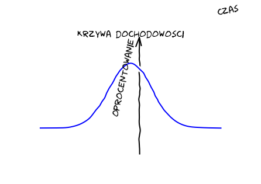
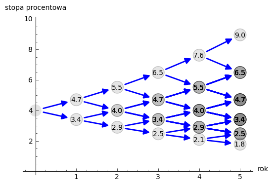

Struktura  terminowa stóp procentowych
======================================

Zamiast wstępu.
---------------

Jeśli mamy do czynienie z instrumentem dłużnym generującym określoną
stopę zwrotu w określonym czasie . I jeśli ponadto inwestujemy kwotę
inwestycji na końcu każdego etapu na okres następny, w którym stopa
procentowa może być inna albo taka sama to mamy do czynienia z
inwestycją wieloetapową.

Jeśli zdefiniujemy zwrot z inwestycji jako:

.. math::
    :label: zwrotR

    R = \frac{P - P_0}{P_0},

 
gdzie: :math:`P` końcowa wartość naszego portfela a :math:`P_0` to
jego wartość początkowa.

Jeśli w portfelu mamy instrument dłużny (instrument stałego dochodu) o
stopie procentowej w danym okresie :math:`i` równej :math:`r_i`, to
licząc wartości portfela w kolejnych etapach inwestowania otrzymujemy:

.. math::
   :nowrap:
   
   \begin{alignat*}{4}
     P_1  = &\; P_0 (1+ r_1)  \\
     P_2 = &\; P_1 (1+ r_2) = P_0 (1+ r_1) (1+ r_2) \\
     P_3 = &\; P_2 (1+ r_3) = P_0 (1+ r_1) (1+ r_2) (1+ r_3)\\
     \dots\quad\ &  \\
     P_n = &\; P_{n-1} (1 + r_n) = P_0 (1 + r_1) (1+ r_2) (1+ r_3)\cdots (1+ r_n) 
   \end{alignat*}

Korzystając ze wzoru definiującego :eq:`zwrotR` widać, że zwrot z takiej
wieloetapowej inwestycji wynosi:

.. math::
   :label: zwrotRn

   R = \prod_{i=1}^n (1+ r_i) - 1

Stopa średnia roczna to wielkość stopy, która pastowana do każdego
roku inwestycji da końcowy wynik równy :math:`R`. Czyli: 

.. math::
   :label: srednia_roczna_pre

   (r_s+1)^n  = \prod_{i=1}^n (1+ r_i) 

Stąd wynika wzór:

.. math::
   :label: srednia_roczna

   r_s = \prod_{i=1}^n (1+ r_i) - 1

Inaczej :math:`r_s` nosi nazwę średniej geometrycznej stopy zwrotu

Przypominam, że w finansach występuję wiele rodzajów
"średnich". Należy zawsze pamiętać jak się je liczy i wiedzieć, że nie
są to raczej średnie arytmetyczne. Średnia arytmetyczna w przypadku
wieloetapowej inwestycji w instrument stałego dochodu była by średnia
arytmetyczną gdyby w każdym etapie inwestowana ta sama wartość
portfela. Dla takich samych ri takich samych i średnia geometryczna
stopa zwrotu jest zawsze mniejsza lub równa średniej arytmetycznej
stopie zwrotu.  

Krzywa dochodowości
-------------------  

Związek miedzy dochodowościami obligacji a czasem ich życia określa
krzywa zwana krzywa dochodowości.  Konstrukcja krzywej dochodowości
jest tylko łatwa jeśli dysponujemy jednorodnymi obligacjami o różnych
datach zapadalności pozwalających na konstrukcje tejże
krzywej. Powinien ten zbiór danych zawierać wszystkie kolejne daty
zapadalności.  Największy problem to właśnie założenie jednorodnego
zbioru obligacji o różnej zapadalności. Obligacje raczej nie są
jednorodne czyli np. charakteryzować się tym samym ryzykiem
charakteryzować się dużą i taka samą płynnością.  Z tych przykładowo
powodów strukturę terminowa stóp procentowych określa się na podstawie
krzywej dochodowości dla wybranych obligacji, przykładowo o tym samym
oprocentowaniu, czy też biorąc pod uwagę stopę zwrotu do zapadalności.

   Krzywa rentowności

Stopy spot to stopy oprocentowania pożyczek dzisiaj: rok, 2 lata,
5lat, 10 lat, etc...  Krzywa rentowności to pokazane aktualnych stóp
spot dla różnych zapadalności.  Z kształtu krzywej rentowności
inwestorzy optymalizują swe działania inwestycyjne. Decydują czy
lepiej reinwestować środki na okresy krótsze czy dłuższe.  

Wyliczanie stop forward ilustrować może poniższy przykład.
Przykładowo przyjmijmy hipotetycznie istniejące instrumenty dłużne,
które obserwujemy na hipotetycznym rynku.  Instrumenty te są
instrumentami emitowanymi przez Skarb Państwa (hipotetycznego) wiec
możemy przyjąć, że są to instrumenty o minimalnym ryzyku na naszym
rynku i ryzyku podobnym.  Przyjmijmy ponadto, że instrumenty te mają
wartość nominalna jednakową – powiedzmy 100 000.  

*???Są hipotetyczne
wiec dlatego założenia jest to możliwe. *

Tak wiec bierzemy pod uwagę jednoroczny bon skarbowy sprzedawany na
rynku po 86 956.  Skarbowa obligacje dwuletnią wypłacającą kupon 15,5%
i handlowana po 100\ 060 oraz trzyletnią obligacje skarbową o kuponie
16,2% handlowana po 770730.  Aby określić stopy forward postępuje się
następująco: Z danych bonu skarbowego wyliczamy stopę roczną: 

.. math::

   TB 86956 = \frac{100 000}{1+r_1} 

stąd :math:`r_1 = 15%`. Z danych obligacji dwuletniej:

.. math::

   100060 = \frac{15500}{ 1 + r_1} + \frac{115500}{( 1+r_1)(1+r_2)} 

stad :math:`r_2 =16%`.

Z danych obligacji trzyletniej otrzymujemy: 

.. math::

    770730 = \frac{16200}{1 + r_1} + \frac{16200}{ (1+r_1) (1+r_2)} + \frac{116200}{(1+r_1)(1+r_2)(1+r_3)}

Stad :math:`r_3 = 17%`.  

.. sagecellserver::

   s =solve( [86956  == 100000./(1+r1),\
        100060 == 15500/(1 + r1)+115500/((1+r1)*(1+r2)),\
        770730 == 16200/(1+r1)+16200/((1+r1)*(1+r2))+116200/((1+r1)*(1+r2)*(1+r3)) ] ,[r1,r2,r3] )

   print map(lambda x:x.rhs().n()*100,s[0])

Przy czym należy podkreślić, że :math:`r_2`
to stopa roczna dla roku drugiego życia obligacji, a :math:`r_3` to
roczna stopa oprocentowania "za dwa lata"  na rok trzeci.

W przypadku stóp  forward użytecznym jest następujące oznaczenie:

Stopy forward to oprocentowanie dla pożyczki zawartej w przyszłości - :math:`F`: 

  - :math:`F(1,1)`  oprocentowanie rocznej pożyczki zawartej w terminie 1 rok od dziś 
  - :math:`F(1,2)`  oprocentowanie 2 letniej pożyczki zawartej w  terminie rok od  dziś. 
  - :math:`F(2,1)`  oprocentowanie jedno rocznej pożyczki zawartej w terminie 2 lat od dziś 

Stopa spot  to szczególny przypadek   -    :math:`S(1) = F(0,1)`

Zasadę tę  ilustruje  rysunek poniżej:

.. figure:: figs/stopy_fwd_ML.png 
   :align: left
   :figwidth: 340px
   :width: 320px
..   :height: 230px

   Zbiór stóp forward i związanych z nimi stóp "spot".

Przyjmijmy ,ze na rynku znajdujemy dwuletni bon skarbowy A o
rentowności rocznej 3,52% a bon roczny B, ma roczną rentowność równa
3,12%. Aby określić stopę forward :math:`F(1,1)`, widzimy że inwestując w bon
A jednostkę pieniędzy otrzymujemy: 

.. math::

   \text{Bon A: }\; ( 1 + 0,0352)( 1 + 0,0352)= 1,0716 

Czyli ok. 7,2% zwrotu. Inwestując natomiast w bon B na rok jednostkę
pieniędzy inwestujemy ja na 3,15% ale możemy otrzymany wynik
reinwestować na kolejny rok na stopę :math:`F(1,1)`. Zakładając, że
na rynku nie istnieje możliwość arbitrażu, to obie te strategie muszą
dać ten sam efekt inwestycji. Czyli: 

.. math::

   (1+ 0,0312) ( 1+ F(1,1)) = ( 1 +0,0352)( 1 + 0,0352) 

Stąd:

.. math::
   ( 1 + F(1,1,) )= ( 1 + 0,0352)( 1 + 0,0352)/1,0312 = 1,0392 

Czyli :math:`F(1,1)` musi wynosić 3,92 % rocznie.

Można postąpić również odwrotnie. Znając zestaw stóp forward możemy
wyliczyć stopy spot.  Załóżmy, że stopa :math:`F(0,1)` wynosi 2,5% a
:math:`F(1,1)`) wynosi 3,2%. Należy wyliczyć :math:`S(2)`.
Postępujemy tak jak poprzednio i porównujemy do siebie dwie możliwe
strategie inwestycyjne.  Inwestujemy jednostkę pieniężną albo:

1) Na  dwa lata przy stopie  :math:`S(2)`, co daje: 
 
    .. math::

        (1+ S(2))( 1+ S(2))= (1+ S(2))^2 

2) Inwestujemy jednostkę pieniężna na pierwszy rok przy stopie :math:`F(0,1)` a następnie efekt inwestycji reinwestujemy na kolejny rok przy stopie :math:`F(1,1)` czyli:
    .. math::
        
       (1+ 0,02)(1+ 0,032)=1,05264 
    
    około 5,27% a to powinno być równe inwestycji 1. 

Innymi słowy:

.. math::

   (1+ S(2))^22 = (1+ 0,02)(1+ 0,032). 

Stąd

.. math::

   (1+S(2)) = [(1+ 0,02)(1+0,032)]1/2= 1,027

czyli :math `S(2) = 2,7%`. 

W ostatnim przykładzie wyliczona stopa spot jest średnia geometryczna
stóp zwrotu forward.  Czego należało się spodziewać, mając na uwadze
wzór :eq:`srednia_roczna`.  

Wiedząc, że:
 
.. math::

   \sqrt^n{a_1 a_2\dotsa_n} <=\frac{1}{n}\sum_{i=1}^n a_i

Możemy używać średniej matematycznej szacowania średniej
geometrycznej. 

Modelowanie ewolucji stóp procentowych
--------------------------------------

Stopa forward to stopa terminowa czyli „pojawiająca „
się za pewien czas. Można interpretować ją jako ewolucje stopy
spot. Gdyby nie istniała niepewność na rynku co do scenariusza
dalszego jego rozwoju to stopa foward byłaby nielosowa i z góry
znana. Jednakże istniejąca niepewność przyszłości zmusza nas do
ustawicznego modelowania ewolucji stopy forward jako procesu
stochastycznego.

Stopy forward pokazują ewolucje stóp na rynku. Wiec należy tą ewolucje
śledzić mając na uwadze efektywne zarządzanie portfelem instrumentów
dłużnych. Temu celowi służy tworzenie modelu aby wyjaśnić ruch stóp
forward. Następnie wyliczamy krzywa rentowności wynikającą ze stóp
forward i porównujemy ja z krzywą stóp aktualnych.  Modelowania polega
przykładowo na stworzeniu modelu dwumiennego (stopa zmieniać się może
okresowo poprzez wzrost lub zmalenie) albo modelu trójmiennego, gdy
wartośc stopy w kolejnym okresie czasu z określonym prawdopodobieństwem
zmienia się w górę lub w dół albo nie zmienia się w ogóle.

   Krzywa rentowności

Przykładowo: Niech w chwili :math:`t=0` stopa procentowa wynosi 4%.  Czyli
:math:`F(0,1) = S(1)`. Stopa może ewoluować w czasie i albo wzrosnąć z
prawdopodobieństwem 50% do wartości 4,7% albo spaść do wartość 3,8% z
prawdopodobieństwem 50%.  4,7 4,0 3,8 
W kolejnym okresie: 5,4 4,7 4,0
4,2 3,8 3,6 Każda z osiągniętych wartości może wzrosnąć o 0,7 z
prawdopodobieństwem 50% lub spaść o 0,2 z prawdopodobieństwem też 50%.
Policzmy rentowności 4,7 Ścieżka 1. 1,04x 1,047 = 1,09 9% 4,0 3,8
Ścieżka 2. 1,04 x 1,038 =1.079 8% S(1) Skumulowany zwrot z dwu lat 0,5
Ścieżka 1 + 0,5 Ścieżka2 = 0,5 x 1,09 + 0,5 x 1,079 =1,085 czyli 8,5%
A zanualizowany zwrot czyli S(2) jest równy (1,085) ½= 1,042 czyli
4,2% 5,4 Scieżka1 = 1,04 x 1,047 x 1,054 = 1,148 14,8 %
			
4,7				Ścieżka 2 = 1,04 x 1.047 x 1,042 = 1,1346   13,5%
4,0				4,2		Ścieżka 3 = 1,04 x 1,038 x1,042 = 1.125      11,25%
3,8
3,6			Ścieżka 4= 1,04 x 1,038 x 1,036 = 1,118  11,18%

Skumulowany zwrot po trzech okresach ( np.latach)
Wynosi:
0,25 x1,148 +0,25 x 1,1346 + 0,25 x 1.125 + 0,25 x 1,118 =1.128
Zanualizowany zwrot po trzech okresach S(3) wynosi
(1.128)1/3 = S(3) =   około 4,2%

 W podobny sposób dla dowolnych ścieżek możemy obliczać  odpowiednie stopy.
 Dla tak przyjętego drzewka  dwumiennego  wspólna zależność to :

		(1 +σ)it  z prawdopodobieństwem 0,5
It+1 = 
		ii/ ( 1+σ)z prawdopodobieństwem 0,5

gdzie sigma jest miara zmienności .
 Duza zmienność ma wpływ na prawdopodobieństwo wystąpienia dużych lub małych stóp procentowych. Ilustruje to rysunek poniżej.

W modelowaniu struktury terminowej najczęściej przyjmuje się  że mamy do czynienia z  procesem Ito  n – wymiarowego ruchu Browna.
 Dla prostego modelu jednowymiarowego  załóżmy ,ze dynamika ma postać:
 
di ( t, T) = α( t,T) dt +_ σdBt
Przykładem takiego jednofaktorowego modelu stopy procentowej jest model Vasicka.

I TUTAJ  Marcinie  w profesorski  sposób opisz stochastycznym równaniem  model Vasicka  i jak się go robi dla różnych sigma i etc
A ja  zamiszcam tutaj taki obrazek( Nie mój  ) symulacji Vasicka

 a do tego w dodatkowym  załączniku arkusz Excela z danymi

