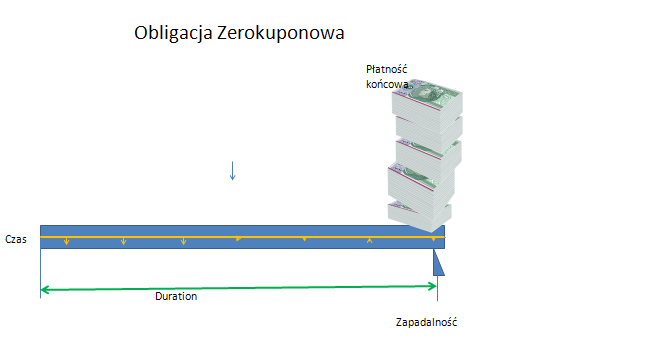

Wartość pieniądza w czasie, renty i kredyty
===========================================

Finanse to wiedza pozwalająca jej posiadaczowi na efektywną alokacje
posiadanych zasobów. Przyjmuje się najczęściej, że miarą efektywności
alokacji jest wzrost wartości. Podstawą decyzji o właściwej alokacji
jest ocena aktywów będących do dyspozycji.

Aktywo, jego wartość, wycena
----------------------------

Aktywo to ta cześć zasobów, która generuje strumień przepływów
pieniężnych.  Aktywo posiada charakterystyczną cechę, która jest jego
wartość.  Wartość aktywa określa rynek.

Najczęściej ta wycena odbywa się metodą aukcji, gdzie aktywo zyskuje
ten, który ofiaruje za niego najwyższą cenę czyli ustala jego
najwyższą wartość.  Porównywaniu wartości aktywów zanim poddane
zostaną testowi aukcji rynkowej służy matematyka. Matematyka pozwala
na porównywanie wartości oraz na przewidywanie ich wartości rynkowej
dzięki oferowaniu pewnych zasad i modeli przydatnych do
wyceny. Matematyczne wyrafinowanie metod i modeli wyceny wzrasta
bardzo szybko. Komputery ułatwiają przeprowadzanie skomplikowanych
obliczeń, niemniej jednak głębokie zrozumienie matematycznych reguł
rządzących finansami jest podstawą tej dziedziny wiedzy. Zdrowy
rozsadek nadal obowiązuje i koniecznym jest głębokie rozumienie tego,
co się liczy i dlaczego.

Wartość aktywów mierzona jest najczęściej wartością
pieniądza. Używając pieniądza do wyceny odkryć można szereg jego
specyficznych cech, o których będzie poniżej.

Pierwsza uwaga dotyczy praktycznego spostrzeżenia, że poszukując
danych finansowych ceny w różnych źródłach znajduje się szeregi (
najczęściej czasowe) danych ceny.  Jeśli dokonuje się porównywania
tych danych należy mieć pewność, że mamy do czynienia z tą samą
wielkością oraz że wielkości te występującą w tych samych jednostkach
miary. Jeśli jednostki są różne wprowadzić należy właściwe
przeliczniki jednostki tak by porównywać to samo a nie przykładowo
mile i kilometry w przypadku porównywania odległości. Ceny w finansach
wyrażane są nie tylko w różnych walutach ale i w różnych sposobach
oddzielania wartości mniejszych od jedności i wartości oddzielania
tysięcy.

Na pytanie co wolimy otrzymać: pewną kwotę pieniężną dzisiaj czy za
jakiś czas odpowiadamy, że wolimy otrzymać tę kwotę dziś. Posiadanie
kwoty dziś jest dla nas lepsze niż otrzymanie jej kiedyś w
przyszłości. Można wiec powiedzieć, że pieniądz dzisiaj ma dla nas
większą wartość niż ten sam pieniądz w przyszłości.  Posiadając
pieniądz możemy nim rozporządzać. Możemy kupić coś teraz lub
przeznaczyć je na inny cel. Jeśli udostępnimy nasze pieniądze innym to
odczuwamy dyskomfort braku kontroli nad nimi, poczucie ryzyka ich
utraty. Za ten dyskomfort spodziewamy się od pożyczającego jakiejś
nagrody. Nagroda powinna być zależna od czasu na jaki je pożyczamy.
Ilość dni jaki upływa między każdorazowym transferem pieniądza jest
istotnym elementem w finansach.

Pieniądz dzisiaj ma dla nas większą wartość niż ten sam pieniądz w
przyszłości.  Jest to odczucie oparte o doświadczenie. Wartość
pieniądza zmienia się w czasie.  Matematyczne zasady zmiany wartości
pieniądza w czasie opierają się na założeniu, że za udostępnienie
pieniędzy komuś, kto potrafi je lepiej zagospodarować należy się
pożyczającemu nagroda w postaci jakiejś części ich wartości. Jest
kilka powodów takiego myślenia.  Pierwszy z powodów to
inflacja. Często obserwuje się wzrost cen w czasie. Nagroda wspomniana
powinna rekompensować zmianę tego poziomu cen. Drugi powód to ryzyko
tego, że pożyczkobiorca nie zwróci pożyczonej sumy.  Nagroda powinna
rekompensować ryzyko niespłacenia długu. Trzeci powód to utrata
możliwości. Pożyczając pieniądze nie możemy zrealizować wspaniałych
możliwości jakie mogą się pojawić czasie gdy nie mamy pieniędzy i
czekamy na ich zwrot. Nagroda wspomniana ma za zadanie rekompensować
wszelkie, możliwe, stracone możliwości. Nawet jeśli dwa pierwsze
powody nie występują, trzeci - wpływa na zmianę wartości pieniądza w
czasie.  To że pieniądz ma różna wartość w czasie powoduje konieczność
szczególnej ostrożności w porównywaniu kwot cyfrowych.

Linia czasu i strumienie finansowe.
-----------------------------------

Pomocna w obliczeniach matematyki finansowej jest linia czasu. Jest to
odcinek prostej łaczący chwilę aktualną (0) z punktem w przyszłości
lub przeszłości. Odcinek ten dzielony jest zazwyczaj na mniejsze
odcinki obrazujace okresy naliczania odsetek.  Na lini czasu nanosi
się strzałki pionowe ilustrujące strumienie pieniężne opisywanej
operacji korzystając z następującej konwencji: wpływ gotówki to
strumień dodatni a wypływ gotówki to strumień ujemny. Linia czasu
ilustrujaca przepływy pieniężne to prosta podzielona na odcinki
okresów (nad osią kolejne numery okresów), na dole lini, lub na
górze - kolejne przepływy( zaleznie od znaku). Ilustracja poniżej
pokazuje przykład lini czasu.

**przykład**

.. sagecellserver::

 cf = [(0,1.2),(1,2),(2,-1),(3,-1.2)]
 p = Graphics()
 for t,v in cf:
     p += arrow((t,0),(t,v))
 p    

Aktywo możemy przedstawić na osi czasowej jako pewien zbiór przepływów
generowanych przez to aktywo.  Strumienie pieniężne mogą mieć znak
plus lub minus. W zależności od tego czy wpływają na wzrost stanu
posiadania gotówki (+) czy też go zmniejszają będąc wpłatą na „obce”
konto(-).  Oś czasowa pozwala na ilustracje efektu wpływu czasu na
wartość pieniężną. Posuwanie się po wartościach pieniądza w kierunku
przyszłości czyli liczenie wartości przyszłej to
kapitalizacja. Liczenie w kierunku przeszłości to dyskontowanie.
Dokonując obliczeń uwzględniających czas należy stosować wykres
czasowy.

Wartość pieniądza w czasie
--------------------------

Mając w posiadaniu pewną kwotę pieniędzy stajemy przed następującym
wyborem: czy wydać te pieniądze natychmiast i kupić sobie coś czyli
innymi słowy skonsumować je czy też przezornie zachować na późniejszy
czas gdy może będą nam bardziej potrzebne?

Jeśli już nie przeznaczamy ich na konsumpcję, to w dalszym ciągu
myślimy jak je przechować do chwili późniejszej.  Chwila refleksji
podsunie nam dość naturalna obawę czy trzymanie pieniędzy w portfelu
(czy tez innym bezpiecznym miejscu, przykładowa skarpeta czy pod
materacem) to najlepsze sposób na nasze pieniądze bo przecież inflacja
zmniejszać będzie ich wartość. Możemy te pieniądze zainwestować i
spowodować by "pracowały" dla nas. Inwestowanie to oddanie własnych
pieniędzy innym, którzy w zamian za użyczenie naszych pieniędzy na
pewien okres zapłacą nam w postaci odsetek od pożyczonego kapitału i
zwrócą go nam w tej samej kwocie co pożyczyli

Taką inwestycją może być lokata bankowa. Depozyt bankowy jest
instrumentem pozwalającym na zwiększenie wartości naszych pieniędzy w
czasie trwania depozytu.

Wpłacając pewną kwotę :math:`P` do banku, na rachunek
oszczędnościowy. Bank płaci nam rocznie roczne oprocentowanie w
wysokości :math:`r`.

Procent prosty
~~~~~~~~~~~~~~

Przykładowo:

Jesli kwote 100 PLN umieścimy na depozycie wypłacajacym 3% rocznie  to:

 - po 1 roku otrzymamy odsetki w wysokosci 3 PLN - które odprowadzamy
   na osobne konto
 - po 2 roku otrzymamy odsetki w wysokości 3 PLN - które odprowadzamy
   na osobne konto
 - po 3 roku otrzymamy odsetki w wysokości 3 PLN - które odprowadzamy
   na osobne konto

Po trzech latach dysponujemu kwotą 100 PLN na końcie depozytowym i
kwotą 9 PLN na osobnym koncie.  Taki sposób naliczania odsetek to
procent prosty.
 

Procent składany
~~~~~~~~~~~~~~~~

Stosując procent prosty można by wpłacić odsetki na tak samo
oprocentowane konto. Jest to równoważne dodaniem odsetek do kapitału
po każdym okresie. Taki zabieg zwany jest procentem składanym.

Procent składany to sposób oprocentowania kapitału, polegający na tym,
że odsetki są doliczane do wartości początkowej kapitału i procentują
wraz z nim w kolejnym okresie bazowym. Odsetki otrzymane po upływie
każdego okresu bazowego są natychmiast reinwestowane na tych samych
warunkach co kapitał początkowy (odsetki są kapitalizowane -
dopisywane do kapitału).

Przykładowo wpłacajac kwote :math:`P` na konto depozytowe
(oszczędnościowe) oprocentowane rocznie procentem :math:`r`.  Po roku
mamy więc:

.. math::

   F= P + Pr = P (1+r)

Po 2 latach zaś jesli po roku pozostawimy w depozycie zainwestowaną
kwotę wraz z odsetkami:

.. math::
  
   F = P(1+r)(1+r) = F (1+r)^2 

Gdzie:

 - F = wartość przyszła
 - P = wartość aktualna (bieżąca) pieniędzy
 - r = stopa procentowa (oprocentowanie roczne)

po :math:`n` latach wartość ta będzie wynosić:

.. math::

   F = P (1+r)^n

Albo inaczej przyjmując  bardziej międzynarodowe oznaczenia:

.. math::

    F_V=P_V(1+r)^n

Gdzie:

 * :math:`F_V` nazywa się  wartościa przyszłą (*future value*)
 * :math:`P_V` to wartość bieżąca  pieniedzy (*present value*)
 * :math:`n` ilość lat
 * :math:`r` - stopa  odsetkowa.

W ten sposób wyliczona została wartośc przyszła zainwestowanych
pieniędzy.  Wartość przyszła jest to wartość jaka narośnie z sumy
inwestycji w pewnym okresie czasu jeśli oprocentowana będzie procentem
składanym przy danej stopie odsetek.

 
Wyliczanie wartości przyszłej wymaga poruszania sie w przód po osi
czasu i naliczania odsetek. Innymi słowy, jest to kapitalizacja.

.. admonition:: Przykład 

   Obliczyć składane odsetki od 100 PLN zainwestowanych na 6% przez 3
   lata. Naliczanie odsetek roczne.

    - 1-szy rok odsetki wynoszą 6.00. Końcowa kwota inwestycji wynosi
      106.00 PLN. Kwota ta jest inwestowana w całości na kolejny rok.
    - 2-gi rok odsetki wynoszą 6.36. Końcowa kwota inwestycji wynosi
      112.36 PLN. Kwota ta jest inwestowana w całości na kolejny rok.
    - 3-ci rok odsetki wynoszą 6.74. Końcowa kwota inwestycji wynosi
      119.11PLN.

   Całkowite odsetki: 19.10 PLN

Kapitalizacja ciągła
~~~~~~~~~~~~~~~~~~~~

Wyobraźmy sobie, że wykonujemy kapitalizację odsetek :math:`m`-razy w
ciągu roku. W takim przypadku stopa procentowa stosowana do obliczenia
odsetek jest będzie wynosiła :math:`\frac{r}{m}`. Na przykład
kapitalizując odsetki półrocznie (:math:`m=2`) ze stopą roczną
:math:`r=6\%` to dwa razy w roku do kapitału dodamy po :math:`r=3\%`:

.. math:: 
   
   F_V = ( 1 + \frac{0.06}{2} )^2 P_V

Okazuje się, że istnieje granica :math:`m\to\infty`, która jest zwana
procesem kapitalizacji ciągłej. W takim procesie kapilalizujemy na
biężąco otrzymywane odsetki. Dla procesu :math:`m` kapitalizacji w
ciągu :math:`n` lat mamy:

.. math::

   F_V = P_V (1+\frac{r}{m})^{m n}   

Jak wiemy funkcja wykładnicza jest granicą następującego ciągu:
:math:`e^x = \lim_{m\to\infty}(1+\frac{x}{m})^m`, więc mamy:

.. math::

   F_V = \lim_{m\to\infty} P_V (1+\frac{r}{m})^{m n} = \lim_{m\to\infty} P_V \left( (1+\frac{r}{m})^m \right)^n = e^{n r} P_V  

Kapitalizacja, dyskontowanie
----------------------------

Gdyby znaleźć się w sytuacji, gdy dzisiaj potrzebujemy pieniędzy,
które możemy zwrócić dopiero po pewnym czasie to znajdując kogoś kto
dziś posiada pewna nadwyżkę pieniędzy możemy pożyczyć od niego
pieniądze. Stajemy przed problemem ile pieniędzy będziemy musieli
zwrócić po pewnym czasie. Dzisiaj wiemy ile potrzebujemu więc:

.. math::

   P_V= \frac{F_V}{(1+r)^n}

Rynek pieniądza znajduje się w równowadze i warunki oprocentowania
"komuś" są takie same jak "od kogoś", czyli stopa dyskontowa jest
równa stopie oprocentowania.

Ostatnia prezentowana zależność pozwala nam obliczyć wartość pieniędzy
w przyszłości - „wartość przyszłą”, znając wartość aktualną
(bieżącą). Proces ten,już wcześniej nazywamy był, kapitalizacją.

Z powyższego wzoru możemy też wyliczyć wartość dzisiejszą (aktualną)
znając wartość przyszłą. Taki proces , posuwania sie w czasie wstecz, zwany jest dyskontowaniem. 

W obu przypadkach należy znać stopę procentową. Stopę tę określa
każdorazowo rynek.
 

Zdyskontowane strumienie pieniężne
----------------------------------

Jeśli nabywamy jakiś instrument finansowy to instrument ten generuje
przepływy finansowe. Przepływy mogą być

 - wypływem na nabycie instrumentu
 - wpływem do inwestora w postaci odsetek lub dywidendy albo końcowej
   wypłaty pieniężnej (zwrot zaciągniętej pożyczki albo wpływ ze
   sprzedaży akcji)

Ponieważ przepływy są odległe od siebie w czasie ich dzisiejsza
wartość musimy obliczyć uwzględniając wartość pieniądza w czasie.

Dyskontowanie przepływów to wyrażanie ich w pieniądzu z okresu
bieżącego czyli wartości aktualnej.

.. math:: 

   P_V =\sum_{i=1}^n P_V(D_i),

gdzie :math:`PV(D_i)` to wartość zaktualizowana przepływu :math:`D_i`.
W przypadku stałych wartości płatności w czasie wzór ten przybierze
postać:

.. math::  

   P_o=\sum\limits_{i=1}^n\frac{D}{(1+r)^i}

Stopa nominalna i efektywna
---------------------------

Nominalna stopa procentowa oznacza stopę procentową obliczoną przy
zastosowaniu procentu prostego. Natomiast efektywna stopa procentowa
określa rzeczywiste oprocentowanie kapitału wynikające z zastosowania
nominalnej stopy procentowej oraz sposobu kapitalizowania odsetek.

Jeżeli odsetki są kapitalizowane raz do roku, to efektywna roczna
stopa procentowa będzie równa nominalnej rocznej stopie
procentowej. Natomiast jeśli odsetki będą kapitalizowane częściej niż
raz do roku, to efektywna roczna stopa procentowa będzie wyższa niż
nominalna roczna stopa procentowa.

Stopa procentowa w jednym okresie bazowym określona jest wzorem:

.. math::

   r =\frac{r_{NRSP}}{n}

gdzie:

 - :math:`r`- stopa procentowa za jeden okres bazowy,
 - :math:`r_{NRSP}` - nominalna roczna stopa procentowa,
 - :math:`n` - liczba okresów bazowych w roku.

Wzór na efektywną roczną stopę procentową ma postać:

.. math::

   r_{ERSP}={(1+r)^n}-1,

lub też

.. math::

   r_{ERSP}={(1+\frac{r_{NRSP}}{n})^n}-1

gdzie:

 - :math:`r_{ERSP}` - efektywna roczna stopa procentowa,
 - :math:`r_{NRSP}` - nominalna roczna stopa procentowa,
 - :math:`r` - stopa procentowa za jeden okres bazowy,
 - :math:`n` - liczba kapitalizacji w roku (liczba okresów bazowych w roku).

Innymi słowy; Jeśli naliczanie odsetek ma miejsce m razy w roku
i na koniec roku n będzie mn płatności odsetek to

.. math:: 

   F_V=P_V(1+\frac{r}{m})^{nm}

czyli przy jednokrotnym  naliczaniu odsetek w roku  wzrost kapitału w ciągu roku bedzie równy

.. math:: r_w=(1+r)

przy półrocznym naliczaniu;

.. math:: 

   r_{wf}=(1+\frac{r}{2})^2

przy naliczaniu kwartalnym

.. math:: 

   r_w=(1+\frac{r}{4})^4

przy naliczaniu miesięcznym

.. math:: 

   r_w=(1+\frac{r}{12})^{12}

a przy naliczaniu dziennym

.. math::

   r_w=(1+\frac{r}{365})^{365}

gdzie:

 - :math:`r_w` - zannualizowany współczynnik wzrostu kapitału.

Czyli  częstsze naliczanie odsetek jest korzystne dla właściciela depozytu.

W sytuacji gdy liczba okresów bazowych n dąży do nieskończoności mamy
do czynienia z kapitalizacją ciągłą. Wzór na efektywną roczną stopę
procentową przy zastosowaniu ciągłej kapitalizacji odsetek przyjmuje
postać:

.. math::

   r_{ERSPC}=(e^r_{NRSP})-1

gdzie:
 
 - :math:`r_{ERSPC}` - efektywna roczna stopa procentowa przy ciągłej kapitalizacji  odsetek,
 - :math:`r_{NRSP}` - nominalna roczna stopa procentowa,
 - :math:`e` -podstawa logarytmu naturalnego.

.. admonition:: Poeksperymentuj z komputerem!

 Wyobraźmy sobie, że mamy depozyt na kwotę :math:`100` na
 oprocentowaniu na pewną stopę :math:`r`. Zbadaj ile będziemy mieli na
 depozycie środków po np. :math:`4` latach w przypadku:

 - kapitalizacji rocznej,
 - kapitalizacji miesięcznej,
 - kapitalizacji ciągłej.

 Na wykresie kolorem czerwonym zaznaczona jest kapitalizacja ciągła,
 zielone punkty to kapilalizacja roczna. Można też zwiększyć częstość
 kapitalizacji depozytu zmieniąc parametr "liczba kapitalizacji w
 miesiącu". Pod wykresem pokazana jest nominalna wartość końcowego
 kapitału w obu procesach i ich względna różnica.
 
.. sagecellserver::
   :linked: false

   var('x')
   @interact
   def _(years=slider(range(1,30),default=4,label='Lata'),rate=slider(0,100,1,default=27,label='stopa roczna (%)'),N=slider(range(1,30),default=1,label='liczba kapitalizacji w roku')):

	    pkts = [(float(i)/N,100*(1+(rate/(N))/100.)^i) for i in range(years*N+1)]
	    plt = line(pkts,color='green',marker='o')
	    plt += plot(100*exp(x*rate/100.),(x,0,years),color='red')
	    sd,sc = pkts[-1][1],100*exp(years*rate/100.)
	    print sd,sc,round((sc-sd)/((sc+sd)*0.5)*100,2),"%"
	    plt.show(figsize=(6,2))

Sposoby  oceny efektywności  aktywa 
-----------------------------------

Dyskontowanie strumieni pieniężnych pozwala na porównanie różnych
przepływów pieniężnych poprzez sprowadzenie ich do porównania ich
wartości w tym samym punkcie czasu.  Dyskontowanie pozwala na
mierzenie efektywności alokacji.

Wartość bieżąca netto
~~~~~~~~~~~~~~~~~~~~~

Jest to wielkość pozwalająca na ocenę efektywności inwestycji.  W
chwili :math:`t = 0` nabywamy aktywo. Nabycie to ujemny przepływ
finansowy w chwili t=0 często ten przepływ nazywamy kosztem
inwestycji.

Wartość bieżącą netto wyliczamy odejmując od przyszłych wpływów
finansowych dzisiejsze koszty inwestycji np. nabycie instrumentu:

.. math::

   NPV=\sum_{t=1}^n\frac{D_t}{(1+r)^t}-I_0

gdzie:

 * :math:`NPV` - wartość bieżąca netto,
 * :math:`D_t` - przepływy gotówkowe w okresie t,
 * :math:`r` - stopa dyskonta,
 * :math:`I_0` - nakłady początkowe,
 * :math:`t` - kolejne okresy (najczęściej lata) inwestycji

Generalnie wartość bieżąca netto to różnica zdyskontowanych wpływów
(ze znakiem :math:`+`) i wypływów (ze znakiem :math:`-`) finansowych
generowanych przez inwestycje.  

Jeśli NPV jest mniejsze od zera to inwestycja jest niekorzystna.

IRR czyli wewnętrzna stopa zwrotu
~~~~~~~~~~~~~~~~~~~~~~~~~~~~~~~~~

Wartość NPV zależy od stopy procentowej. Wyobraźmy sobie sytuację w
której inwestujemy w pewny biznes środki z kredytu na pięć lat. Biznes
ten przyniesie zysk już za rok - pewnej stałej wartości nominalnej,
tak, że NPV jest dodatnie i wyjdziemy na swoje. Jednak jeśli stopa
procentowa wzrośnie, to może się okazać że kredyt będzie nasz
kosztował więcej niż zysk z inwestycji. W finansach stosuje się
pojęcie wewnętrzej stopy zwrotu (ang. IRR). Z definicji jest to taka
stopa przy której :math:`NVP=0`. Obliczenie IRR sprowadza się
matematycznie do znalezienia miejsca zerowego wielomianu. Jak
rozwiązań :math:`NPV=0` może być wiele, ale w tym przypadku interesuje
nas najmniejsze dodatnie miejsce zerowe. Ponieważ mamy do czynienia z
wielomianem rzędu większego od czterech do rozwiązywania stosujemy
metody przybliżone.

Obliczanie  wartości pieniadza w czasie
---------------------------------------

Poniżej pokazane będą dwa przykłady obliczeń z tego zakresu. Nie
wymagają bardzo użycia bardzo skomplikowanych metod obliczeń ale mają
za zadanie pokazać specyfikę tego rodzaju obliczeń i przydatność w tym
celu komputera oraz wymaganych na wielu egzaminach zawodowych
umiejętności posługiwania sie kalkulatorem finansowym, które to
urządzenie ma wbudowane możliwości liczenia szeregów geometrycznych i
jest niezwykle przydatne w finansach. Warto zapoznać sie z tym
urządzeniem i umieć dokonywać na nim różnych obliczeń.

Zgodnie z komunikatem nr 8 Komisji Egzaminacyjnej dla doradców
inwestycyjnych z dnia 22 lutego 2006 podczas egzaminów na doradców
finansowych mogą być używane jedynie kalkulatory rekomendowane przez
Komisję. Przykładowo kalkulatory finansowe HP 10BII oraz 12C Platinum
zostały dopuszczone do używania podczas egzaminów na doradców
inwestycyjnych.

.. admonition:: Przykład

 Jaka jest wartość aktualna (bieżąca) kwoty 1000 PLN którą otrzymamy
 za 15 lat jeśli dzisiaj oferują nam depozyt na 7% rocznie?

Wartość pieniądza w czasie - uwagi podsumowujące
------------------------------------------------

Mówiąc o wartości pieniężnej  należy mieć na uwadze czas dla którego wartość ta jest określana. 
Czas bowiem zmienia wartość pieniędzy.
Uwagi końcowe:

* Porównując wartości pieniężne sprawdzić należy w jakich jednostkach są  podawane.
* Dwie wielkości  wartości pieniężnych mogą być porównywane ( w tym dodawane lub odejmowane) jeśli  dotyczą tego samego momentu czasu.
* Jeśli porównuje się  wartości monetarne w różnych momentach czasowych należy zastosować odpowiednie przeliczniki zwane dyskontowaniem lub kapitalizacją.
* Jeśli mamy dwie wartości monetarne :math:`X` i :math:`Y`, to:

  - Jeśli wartość :math:`X > Y` (lub :math:`X<Y`) w czasie :math:`t_1` to
    jest większa (lub odpowiednio mniejsza) w czasie :math:`t_2`.
  - Jeśli :math:`X =Y` w czasie :math:`t_1` to :math:`X` będzie
    równa :math:`Y` w każdym czasie :math:`t_2`.

Jak obliczyć ilość dni pomiędzy dwoma datami?
---------------------------------------------

Ilość dni jaki upływa między każdorazowym transferem pieniądza jest
istotnym elementem w finansach.

Ilość dni między datami 
~~~~~~~~~~~~~~~~~~~~~~~

Jedną z możliwości jest konwersja daty do ilości dni Juliańskch. Jest
to liczba dni, która upłynęła od 1 stycznia roku 4713 p.n.e., według
kalendarza juliańskiego. Metoda i algorytm jest opisana na stronach
Wikipedii: `Data Juliańska
<https://pl.wikipedia.org/wiki/Data_julia%C5%84ska>`_.

Większość systemów komputerowych ma wbudowaną funkcję pozwalającą na
obliczanie ilości dni pomiędzy dwoma datami. Na przykład w języku
python można wykorzystać moduł datetime w następujący sposób: 

.. sagecellserver::

   from datetime import date
   data1,data2 = (1980,10,31), (1989,5,1)
   print date(*data2)-date(*data1)

   

Wyliczmy jeszcze ile mamy dni pracujących począwszy od 1 października 2014 do
17 lutego 2015 - czyli w semestrze zimowym: 

.. sagecellserver::

    from datetime import date,timedelta
    data1,data2 = (2014,10,1), (2015,2,17)

    d = date(*data1)
    c=0

    while d<=date(*data2):
        if  d.weekday()<5:
            print d,d.strftime("%A")
        d += timedelta(days=int(1))
        c+=1
    print c

Ilość dni pracujących - dni roboczych ma istotne znaczenie dla różnych
obliczeń na rynkach finansowych. Dlatego umiejętność takich obliczeń
jest bardzo istotna.  Przy takich obliczeniach należy pamiętać o
różnych kulturach i różnych dniach świątecznych obowiązujących na
świecie jeśli nasze rozliczenia dotyczą różnych krajów.  Dla obliczeń
instrumentów finansowych przyjmuje się różne ilości dni w
roku. Długość roku kalendarzowego wymosi 365/366 dni. Taki rok
charakteryzuje pewne instrumenty szczególnie popularne na rynku
brytyjskim. Rok o długości 360 dni - to tzw. rok obrotowy
(:math:`12\times30` dni). Taka miara roku popularna jest na rynku
amerykańskim. Instrument finansowy posiada w swym opisie informacje
jaki format dni w roku jest stosowny dla tego instrumentu.

.. admonition:: Poeksperymentuj z komputerem!

   Ile wtorków będzie w tym semestrze?

.. sagecellserver::

   print "liczba wtorków:"

Standardy liczenia dni w praktyce finansowej
~~~~~~~~~~~~~~~~~~~~~~~~~~~~~~~~~~~~~~~~~~~~

W matematyce finansowej spotkać można kilka standardów na określanie
odległości w czasie.

1.  Dokładna liczba dni Przyjmuje się, że rok liczy 365/366 dni a
    ilość dni liczy sie przykładowo tak ja w powyżej pokazano. Każdy
    miesiąc ma tyle dni ile przewiduje kalendarz. Ilość lat określa
    się dzieląc ilość dni między datami przez ilość dni w roku.
2.  Zasada równych miesięcy. Według tej zasady rok liczy 360 dni i dzieli
    się na 12 miesięcy po 30 dni. Tzn. w lutym jest data 29luty oraz
    30luty.  A 31 nie występuje w żadnym miesiącu.  Zasada ta
    stosowana jest w 3 wersjach:
   
    A. Metoda Europejska - 12 miesięcy po 30 dni. 360 dni w roku.
       Metoda czasem nazywana 30/360.  W tej konwencji liczone są
       renty i spłaty kredytów większości kalkulatorów.  Stosuje się
       tą metodę do szybkich przybliżeń w matematyce finansowej.

    B. Dokładna liczba dni w miesiącach - rok 360 dni. Wylicza się
       prawdziwą ilość dni między datami (tak jak w przypadku
       kalendarza juliańskiego). Stosowanie tej metody zwanej czasami
       metodą bankową powoduje to, że kredytobiorca powinien płacić
       odsetki od rzeczywistych dni w miesiącu. Innymi słowy powinien
       zapłacić za dodatkowe 5 lub 6 dni w roku w porównaniu do metody
       30/360. Czyli stopa oprocentowania rocznego kredytu praktycznie
       dla niego wyniesie:
       :math:`r=\frac{365}{360}r' =20.28\%`, gdzie
       :math:`r'` - stopa określona dla kredytu
    C. Metoda stosowana na rynku amerykańskim (NASD) to 12 miesięcy po
       30 dni każdy.
       http://www.hsbcnet.com/gbm/attachments/standalone/2006-isda-definitions.pdf
       Zasady poprawek do daty aktualnej dla instrumentów
       naliczających odsetki na koniec kalendarzowego miesiąca. Może
       być potrzebne stosowanie kilku poprawek. Stosuje się je w
       następującej kolejności:

          * Jeśli data1 przypada na ostatni dzień miesiąca lutego i
            data2 przypada też na ostatni dzień miesiąca lutego
            (innego roku) to zmienia się datę2 na 30.
          * Jeśli data1 przypada na ostatni dzień lutego to zmieniamy
            ją na 30.
          * Jeśli data 2 przypada na 31 i data 1 przypada na 30 to
            zmieni się datę 2 na 30.
          * Jeśli data1  przypada na 31 to zmienia się ją na 30.

Należy pamiętać, że pewne instrumenty finansowe rozliczane są w
tygodniach. Przykładowo bony skarbowe. W tym przypadku rok ma 52
tygodnie i dzieli się na 4 kwartały po 13 tygodni. Tydzień to 7 dni.

Instrumenty finansowe mają bardzo interesujące zasady naliczania czasu
i zawsze należy zaznajomić się regulacjami przyjętymi dla danego
instrumentu finansowego.  Sprawę dodatkowo komplikują różne standardy
używane na świecie.

Renty i kredyty
---------------

Renty
~~~~~

Renta to jest ciąg płatności. Zazwyczaj płatności występują
regularnie (równe okresy) i zazwyczaj w równej wielkości. Źródłem
takich strumieni finansowych mogą być np;, obligacje (płatności
kuponowe), opłaty czynszowe wpływające za wynajem lokalu, akcje
wypłacające regularnie dywidendę, odsetki od lokat terminowych etc. .

Wielkości charakterystyczne dla rent to :
Wielkość płatności, odstęp czasowy między płatnościami, moment płatności, sposób naliczania odsetek, otoczenie stopy procentowej  i ilość rat .

Renta wieczysta
+++++++++++++++

Renta wieczysta to nieskończony ciąg, równookresowych i równych
płatności. Rozpoczęcie analizy przypadku rent od takiego modelu
spowodowane jest jego znaczącym miejscem w matematyce
finansowej. Niech renta ta to ciąg płatności C. Płatności są płacone
na koniec kolejnych okresów, czyli pierwszy strumień pojawia się w
okresie1.  Wartość bieżącą tego ciągu płatności w punkcie t = 0
policzyć można dyskontując płatności do chwili t = 0 w następujący
sposób:

.. math::

  PV = \frac {C}{(1+r)}+\frac{C}{(1+r)^2} + \frac{C}{(1+r)^3}+ ... \frac{C}{(1+r)^n} +  ...

Jeśli obie strony pomnożymy przez :math:`(1+r)`, otrzymamy:

.. math::

   PV(1+r) = \ C + \frac {C}{(1+r)}+\frac{C}{(1+r)^2} + \frac{C}{(1+r)^3}+ ... \frac{C}{(1+r)^	n} + ...

Po prawej stronie równania wyrazy występujące po :math:`C` to
nieskończony szereg płatności jak w wyjściowym równaniu czyli ta cześć
sumy to :math:`PV`

Czyli

.. math::

   PV(1+r) =  C + PV 

Stąd 

.. math::

  PV= \frac{C}{r} 

Wartość bieżąca takiego instrument to cena tegoż instrument zwana też
wartością godziwą.

 - :math:`PV` - to tyle ile jest warty taki  instrument

Wzór prosty i łatwy do zapamiętania ale pojawia sie pytanie czy jest
to tylko model teoretyczny czy takie instrumenty istnieją. Takie
obligacje, zwana konsolami wyemitował rząd brytyjski na potrzeby
finansowania wojny z Napoleonem Bonaparte i spłaca je do dziś i
zamierza to robić do końca swego istnienia. Korporacja Disneya
wyemitowała obligacje stuletnie. Można policzyć wartość tej obligacji
i porównać go z wartością konsoli aby przekonać się jak dobrze
obligacje Disneya przybliżają obligacje wieczystą.  

Zastosowanie renty do określenia wartości godziwej akcji czyli renta wieczysta o rosnącej racie
+++++++++++++++++++++++++++++++++++++++++++++++++++++++++++++++++++++++++++++++++++++++++++++++

Zanim zostanie opisane zachowanie się aktywa zwanego akcją czyli
instrumentu własnościowego rozważyć należ przypadek jak wycenić rentę
wieczystą, której wartość raty w czasie będzie wzrastała. Wzrost
następuje co okres o g %. Innymi słowy:
w po okresie 1 rata jest
równa C,
po okresie 2 rata to :math:`\frac{C}{(1+g)}` 
a po okresi 3 rata jest równa :math:`\frac{C}{(1+g)^2}` etc.

Wartość bieżąca czyli cena będzie równa sumie zdyskontowanych rat:

.. math::

   PV = \frac{C}{1+r}+\frac{C(1+g)}{(1+r)^2} + \frac{C(1+g)^2}{(1+r)^2}+...\frac{C(1+g)^n-1}{(1+r)^n} + ...

Mnożąc obie strony równania przez :math:`\frac{1+r}{1+g}` postępując
podobnie jak w przypadku renty wieczystej otrzymujemy: 

.. math::

   PV \frac{1+r}{1+g} = \frac{C}{1+g} + PV \frac{1+r}{1+g}

Po prostych przeliczeniach algebraicznych otrzymujemy: 

.. math::

   PV= \frac{C}{r-g}

Gdzie g<r.

Wycena  akcji w oparciu o wartość wypłacanej dywidendy
++++++++++++++++++++++++++++++++++++++++++++++++++++++

Zastosowanie powyższego rozumowania do wyceny wartości akcji samo się
narzuca. Akcja to instrument właścicielski dający właścicielowi prawo
do udziału w majątku emitenta akcji,  w tym prawo do
dywidendy. Dywidenda to udział w zysku.  Należy pamiętać, że jeśli
akcje kupujemy na nieznany okres to należy traktować spółkę jako
źródło dywidendy na okres nieskończony. Spółka bowiem nie ma
zdefiniowanego czasu życia. Raczej należy myślec tu o czasie
nieskończonym a nie o skończonym ciągu rat.  Jeśli tak to w tym
przypadku :math:`n\to\infty` to dla skończonej ceny w
nieskończoności Otrzymujemy 

.. math:: 

   PV=\sum\limits_{i=1}^n\frac{Ci_i }{(1+r)^i} 

Model powyższy określania ceny godziwej akcji jest zwany modelem
dyskontowanej dywidendy.  Należy podkreślić w tym miejscu kilka
aspektów stosowania modeli. Pierwszy aspekt, należy pamiętać, ze jest
to model. Założenie nieskończonego życia spółki powoduje, ze wycenę
dzisiejszej wartości spółki nie wymaga znajomości przyszłej ceny
akcji. Model ten wskazuje, że w cenie aktualnej akcji są „zawarte”
nieskończony ciąg przyszłych dywidend.

Jeśli weźmie się do analizy zyski firmy to uwaga, że
firma niezwykle rzadko przeznacza cały zysk na dywidendę jest
niezwykle trafną uwagą. Konsekwencją takiego myślenia jest, to, że cena
wyliczona z dywidend, które zazwyczaj są mniejsze niż zyski firmy
może dać wartość mniejszą niż w oparciu o wzrost zysków. Ale dla tego
modelu przyjmuje się jeszcze jedno założenie- jeśli zyski firmy
rosną, to dywidenda też powinna rosnąć w tym samym tempie.

Przypadek stałego wzrostu. Wzrost zerowy dywidendy
++++++++++++++++++++++++++++++++++++++++++++++++++

Załóżmy, że spółka płaci stała dywidendę nie ma szans na jej wzrost w
rozsądnej przyszłości.  Czyli:
 
.. math::

  D_1 >   = D_2   = ... = D_i

Gdzie :math:`D_i` to i-ta dywidenda.

Jeśli ma stała wartość :math:`C`, to stały strumień pieniądza
generowany przez wypłatę dywidend do nieskończoności jako sumy szeregu
nieskończonego daje wynik:

.. math::

   P_o = \frac {C}{r}

Czyli mamy przypadek renty wieczystej.

Innymi słowy cena akcji jest równa wartości wieczystej dywidendy
dzielonej przez stopę dyskontową. Jeśli stopa dyskontowa jest stopą
rynkową dyskonta (właściwą dla ryzyka inwestycji w tą akcje) to tak
uzyskana cena jest ceną rynkową. Chociaż liczba firm wypłacających w
nieskończoność stałą dywidendę jest praktycznie raczej niewielka, to
ten model jest przydatny do wyceny jeśli aktualnie wypłacane dywidendy
nie zmieniają się od pewnego czasu. Z pewnością równanie takie można
stosować dla wyceny akcji uprzywilejowanych (co do wielkości wypłaty
dywidendy).  

Stały wzrost dywidendy. Wzrost większy od zera
++++++++++++++++++++++++++++++++++++++++++++++

Przyjmujemy, że dywidenda wzrasta z roku na rok o czynnik g.

Cena z modelu dyskontowego dywidendy jest

.. math::

   P_o=\sum_{i=1}^n\frac{D_i}{(1+r)^i}

Jeśli wzrost dywidendy jest stały możemy kolejne dywidendy zapisać
korzystając z dywidendy okresu poprzedniego i czynnika wzrostu
 
.. math::

   D_1 = D_0(1+g) 

Gdzie

  G -  jest procentowym wzrostem dywidendy (zysków)  W kolejnym roku

.. math::

  D_2=(D_1 )(1+g)

Czyli:

.. math::

  D_2=(D_0 )(1+g)^2 

Dla  i-tego roku

.. math::

  D_i=(D_0 )(1+g)^i

Wstawiając tak wyliczoną i-tą dywidende do wzoru na cene akcji w
modelu dyskontowania dywidendy otrzymamy tosamo co dla wzrostu renty
wieczystej o czynnik g:

.. math::

   PV = P_0 = \frac{C}{r-g}

To ostatnie równanie jest zwane równaniem modelu Gordona i jest
najczęściej stosowanym równaniem dla dywidendowej wyceny akcji
spółki. Nazwa równanie Gordona jest przyjęte w literaturze mimo, kilka
lat wcześniej równoważny model została zaprezentowany przez
J.B.Williams’a w „Theory of Investment Value”( Cambridge, MA: Harvard
University Press, 1938).

Na pytanie co w przypadku gdy g jest większe od r???  odsyłamy do
rozważań przedstawionych w pozycjach : Ramesh Rao „Financial
Management” –Uniwersity of TexasSoth Western College Publishing1995i
lub R.A.Brealey, S.T.Myers-„ Priciple of corporate Finance” McGraw
HillComp-1996.

Renta dla skończonej ilości okresów
+++++++++++++++++++++++++++++++++++

Jeśli mamy do czynienia ze skończona liczbą rat to wartość
aktualną takiego szeregu możemy policzyć.  Możemy postąpić na przykład w 
taki sposób: Kupujemy rentę wieczystą a po n okresach jej posiadania
sprzedajemy ją na rynku. Tak więc z nieskończonego ciągu rat
wybraliśmy dla siebie wartość skończonego szeregu
rat. Przeprowadziliśmy operacje kupna nieskończonego ciągu rat i jego
sprzedaży po n okresach. Jak jest wartość transakcji?  Kupiliśmy rentę
wieczystą za cenę: 

.. math::

   P_o =PV= \frac {C}{r}

A następnie sprzedaliśmy po czasie n okresów rentę wieczystą za którą
dostaliśmy taką cenę jak jest warta renta wieczysta czyli:
:math:`P_o
= \frac{C}{r}`.
Tylko, że dostaliśmy tę cenę po n okresach. Jej
wartość bieżąca to :

.. math:: 

   P_o=PV=\frac{C/r }{(1+r)^n}

Czyli cena transakcji, która jest wartością skończonego szeregu
płatności to: 

.. math::

   P_0=PV=\frac {C}{r}-\frac{C/r }{(1+r)^n}

Albo inaczej: 

.. math::
   :label: PV1
 
   P_0=PV=\frac {C}{r}\left(1-\frac{1 }{(1+r)^n}\right)

A ten wzór opisuje  kredyt wzięty dzisiaj o wartości bieżącej sumy n spłat płaconych w przyszłości w kolejnych okresach.

Renta płatna  na początku okresów
+++++++++++++++++++++++++++++++++

.. todo MK z sage teoria procentu 

Może być taka sytuacja, że płatności nie występują na końcu okresu ale
na jego początku. Innymi słowy w chwili t=o następuje płatność za
okres1 a w chwili =2 płatność za okres 1. Czyli wartość przyszła jest
kapitalizowana o jeden okres więcej czyli:

.. math:: 

   FV_2=FV_1 (1+r)

Gdzie :math:`FV_{2}` to wartość przyszła płatności na początku okresu
a :math:`FV_{2}` to wartość ptrzyszła płatności na końcu okresu.
Wzory na wartość bieżąca można prosto wyliczyć podobnie.  Wyliczenia
wydaja się intuicyjnie proste bo następuje przesuniecie płatności o
jeden okres

Kredyty
~~~~~~~

Wyliczenia wartości aktualnej przyszłych, równych strumienie
pieniężnych , tak jak w przypadku renty, może zostać zastosowane do
wyliczenia spłaty kredytu.  Kredyt bowiem to kwota pieniędzy
otrzymywana dzisiaj od kredytodawcy i spłacana w przyszłości
najczęściej w równych odstępach czasu. Jeśli kwoty spłat są równe to
jest to jak w przypadku renty.  Spłata kredytu określona przez zasady
renty to spłata równymi ratami okresowymi (przykładowo płaconymi co
miesiąc).  Z wyliczeń dotyczących renty wynika, że:

.. math::

   PV = PMT \frac{1-\frac{1}{(1+r)^n}}{r}

Gdzie:
   - PV - wartość aktualna (bieżąca)
   - PMT - płatność regularna, okresowa, rata.
   - R -  stopa procentowa
   
Oznaczenie PMT użyte zostało, gdyż jest to światowy standard, używany
we wszelkich kalkulatoprach finansowych. Wcześniej ta wielkośc była
nazywana C (patrz wzór :eq:`PV1`).  Proste matematyczne przekształcenie wzoru pozwala
obliczyć wartość raty spłaty kredytu w tym sposobie spłacania.

.. math::

   PMT  = \frac{\mathrm{PV}\; r}{1-(1+r)^{-n}}

Innym sposobem spłacania kredytu, stosowanym przez banki, jest sposób
spłacania równymi ratami kapitałowymi.  W tym sposobie wysokość
okresowej raty spłacania kredytu obliczana jest w następujący sposób:
Wielkość pożyczonej kwoty jest dzielona przez ilość okresów
spłaty. Otrzyma w ten sposób wielkość rata kapitałowa. Kapitał
pożyczony w ramach kredytu jest spłacany równymi ratami
kapitałowymi. Do tej raty należy doliczyć koszty pieniądza czasie
czyli koszt odsetek od pożyczonego (a nie zwróconego jeszcze)
kapitału.  Wielkość raty spłaty na koniec każdego kresu określona jest
jako suma raty kapitałowej i wartość czasowa odsetek od niespłaconego
kapitału.  Obrazuje to poniższy wzór:

.. TODO!!!! z sage !

.. math::

   dj = \frac{P}{N} + Odj
   
   

gdzie :
 - dj- rata spłaty kredytu
 - P/N- rata kapitałowa (P – kwota pożyczona, N ilość okresów spłaty)
 - Odj- odsetki od niespłaconego kapitału.

część odsetkowa = kwota kredytu pozostała do spłaty razy oprocentowanie w skali roku/ilość rat w roku
Sumaryczna wielkość raty spłaty kredytu składająca się z raty kapitałowej i odsetek jest wielkością malejącą w czasie spłaty gdyż  wielkość odsetek  maleje.
Porównanie spłaty  kredytów pokazuje tabela

TABELA

Wstawić tabele!!!!!!!!!!!!!!!!!

.. sagecellserver::
   :linked: false

   K = 1000.0
   r = 0.2
   N = 5
   Kt=[["winny","rata","odsetki","rata kapitalowa"],[K,0.,0.,0.]]
   PMT = Kt[-1][0]/sum( [1/(1+r)^i for i in range(1,N+1)] )
   for i in range(1,N+1):
       kredyt = Kt[-1][0]
       odsetki = kredyt*r
       rata_kapitalowa = PMT - odsetki
       Kt.append( [kredyt+odsetki - PMT, PMT, odsetki, PMT-odsetki])
   table(Kt) 

.. sagecellserver::
   :linked: false

   Kt=[["winny","rata","odsetki","rata kapitalowa"],[K,0.,0.,0.]]
   for i in range(1,N+1):
      kredyt = Kt[-1][0]
      odsetki = kredyt*r
      rata_kapitalowa = 200
      PMT = rata_kapitalowa + odsetki

      Kt.append( [kredyt+odsetki - PMT, PMT, odsetki, PMT-odsetki])
   table(Kt)
		    

.. NOWY ROZDZIAL!

Depozyt na rynku pieniężnym
---------------------------

Depozyty rynku pieniężnego to instrumenty stałego oprocentowania,
które to kontrakty są zawierane na określony okres czasu i nie mogą być likwidowane
przed terminem zapadalności.

Ponieważ są instrumentami rynku pieniężnego ich okres do zapadalności
jest mniejszy od jednego roku. Powoduje to potrzebę przeliczania
rocznej stopy procentownia na okresy mniejsze od roku.  Sumę odsetek
na koniec okresu depozytu wyliczyc można ze wzoru:

 .. math:: 

    R = D d \frac{n}{360}

Gdzie:

 * R = suma odsetek
 * D = wartość depozytu
 * d = oprocentowanie depozytu (annualizowane)
 * n = ilość dni pomiędzy początkiem okresu depozytu a jego zapadalnością 

Należy zwrócić uwagę,ze przyjęto tutaj standard roku liczącego 360
dni.  Gdyby standard był inny (a jest to częsty przypadek) należy
uwzględniać inną wartość dni w roku.  Efektywną stopę zwrotu na
depozycie można wyliczyć ze wzoru na wartość pieniądza w czasie.

Instrumenty dyskontowe
----------------------

Są to typowe instrumenty rynku pieniężnego wyceniane na zasadzie
dyskonta tzn. są handlowane z dyskontem w stosunku do wartości
nominalnej. Jak już to było wykazane, ich cena aktualna jest równa

.. math::

   P =\frac{FV}{(1+Y \frac{DDW}{360})}

gdzie:

 - P - cena rynkowa

 - FV - wartość nominalna
 
 - Y - rentowność

 - DDW - ilość dni do wykupu,

Przyjęto standard roku liczącego 360 dni- standard dla Bonów
Skarbowych na polskim rynku.

Wycena obligacji
---------------- 

Obligacja jest to papier wartościowy (instrument finansowy),
stwierdzający zaciągnięcie przez emitenta obligacji długu wobec
posiadacza obligacji - zwanego obligatariuszem i zawierający
zobowiązanie, wobec obligatariusza do wykupu obligacji - jako zwrotu
zaciągniętego długu oraz wypłacenia odsetek za korzystanie z
użyczonych pieniędzy oraz terminowość wypłat. Odsetki mogą być
wypłacane w określonych momentach (tzw. kupony) lub w postaci dyskonta
w momencie emisji (obligacja zerokuponowa). Innymi słowy jest to
dokument potwierdzający zaciągnięcie długu i zobowiązanie do jego
spłacenia.

Dlaczego emitent wybrał taki sposób pozyskania kapitałów na
finansowanie swych projektów?  Dlaczego nie zaciągnął kredytu
bankowego?  Pytania te wskazują na podstawowe różnice w sposobie
finansowania przy pomocy rynku kapitałowego a rynku usług bankowych.

Pierwsza różnica uniknięcia pośrednictwa banków wykorzystując obszar
marży bankowej dla korzyści uczestników rynku. Banki oferują depozyty
dla klientów (płacąc im w zamian odsetki) by mieć środki na udzielanie
kredytów. Marża banku to różnica oprocentowania między oprocentowaniem
depozytów a oprocentowaniem kredytów. Emitent obligacji chce uzyskać
niższe oprocentowane kredytu oferując dla uczestników rynku wyższe
oprocentowanie niż oprocentowanie depozytów bankowych (szansa dla
obligatariuszy) ale uzyskując dla siebie niższe oprocentowanie niż w
przypadku oprocentowania kredytów bankowych (korzyść emitenta).

Druga różnica wiąże się kształtem strumieni przepływów środków
pieniężnych w obu przypadkach. Typowy kredyt polega na początkowym
transferze kapitału od banku do kredytobiorcy i kolejnych regularnych
(najczęściej) spłatach części kapitału wraz z odsetkami od
niezwróconego do tego momentu kapitału.  W przypadku obligacji
(najczęściej) w chwili początkowej następuje przepływ środków od
obligatoriusza do emitenta, następnie w równych czasowych okresach
emitent płaci odsetki od pożyczonego kapitału. Wraz ze spłatą
ostatniej kwoty odsetek emitent spłaca całą kwotę, którą jest dłużny
obligatariuszom.

Trzecia różnica to korzyść z tego, że obligacja jest papierem
wartościowym będącym w obrocie. Właściciel obligacji, jeśli
potrzebuje gotówki nie musi czekać na spłatę przez emitenta ale może
uzyskać środki pieniężne sprzedając obligacje na rynku komuś innemu.

Cechy charakterystyczne określające obligacje:

 * wartość nominalna - jest to wartość zaciągniętego długu, od której
   nalicza się odsetki i która jest płacona w momencie wykupu przez
   emitenta posiadaczowi obligacji;
 * termin wykupu - jest to termin, w którym obligatariusz otrzymuje od
   emitenta kwotę równą wartości nominalnej; w terminie wykupu
   obligacja podlega wykupowi;
 * oprocentowanie - stopa procentowa określająca wielkość odsetek
   wypłaconych obligatariuszowi;
 * terminy płacenia odsetek, - czyli częstotliwość wypłat
   odsetek. Przykładowo: raz na rok, raz na pól roku, kwartalnie.
 * cena emisyjna - to cena, po której obligacja jest sprzedawana jej
   pierwszemu posiadaczowi w momencie emisji. Cena ta może być zarówno
   niższa jak i wyższa od ceny nominalnej. Decyzja emitenta zależy w
   tym przypadku do przewidywanego zainteresowania i oprocentowania
   obligacji.

W charakterystycznych cechach obligacji wymienione zostały dwie cechy
związana z wartością obligacją. Były to cena (wartość) nominalna i
cena emisyjna. W rynkowym obrocie obligacjami używa się jeszcze
terminów ceny rynkowej i rozliczeniowej. ''Cena rynkowa'' (kurs
giełdowy), jest ustalana na codziennych sesjach giełdowych, jako
wypadkowa popytu i podaży. Oczywiście dotyczy to obligacji
dopuszczonych do obrotu publicznego i notowanych na
giełdzie. Określana jest w procentach wartości nominalnej. Nie
jest to jednak faktycznie ta cena, jaką faktycznie płaci kupujący i
otrzymuje sprzedający obligacje, ponieważ nie uwzględnia narosłych
odsetek przypadających w danym dniu. ''Cena rozliczeniowa'', czyli
cena giełdowa powiększona o narosłe odsetki, to rzeczywista kwota
transakcyjna, jaką płaci kupujący i otrzymuje sprzedający
obligacje. Aby ją obliczyć, należy po prostu dodać do ceny rynkowej
należne w tym dniu odsetki. Wartość obligacji na rynku (a zatem jej
cena), jak zostało wcześniej wspomniane, kształtuje się w wyniku
popytu i podaży, które z kolei zależą od różnych
czynników. Najważniejszym czynnikiem kształtującym wartość obligacji
jest poziom stóp procentowych.

Inwestorzy często dokonują wyceny obligacji. Wycena obligacji polega
na określaniu tzw. "godziwej ceny obligacji" (fair price), która
powinna odzwierciedlać wartość obligacji. Najczęściej stosowaną metodą
przy wycenie jest metoda dochodowa, inaczej zwana metodą
zdyskontowanych przepływów pieniężnych.

Wycena obligacji - polecana literatura poszerzająca, objaśniająca ten
rozdział to: Joanna Place- "Basic Bond Analysis"- Handbook in Central
banking- nr.20- Bank of England,2000; raz pozycja autorstwa Jerzego
Dzieży - 'Instrumenty stałego dochodu- AGH- dostepne w sieci Internet,
oraz David Blake - Financial Market Analysis- McGraw- Hill.

Cena godziwa (fair price)
-------------------------

Instrument ten generuje zdefiniowane strumienie pieniężne w
czasie. Inwestor kupuje te strumienie oceniając ich wartość dla
siebie. Jeśli mamy obligację, której emitent zobowiązuje się do
płacenia odsetek regularnie raz do roku i zamierza zwrócić zaciągnięte
zobowiązanie (wartość nominalną) w chwili wykupu, na koniec życia
zobowiązania, to godziwa cena dla inwestora takiego instrumentu jest
wynikiem zdyskontowanej wartości bieżącej przepływów pieniężnych
generowanych przez takie zobowiązanie. Stopa dyskontowa jest określana
przez rynek.

.. math::

  P_o=\sum\limits_{i=1}^n\frac{C}{(1+r)^i} +\frac{P_N}{(1+r)^n},

gdzie

 - :math:`C` - odsetki (ang. coupon)
 - :math:`P_o` - wartość obligacji
 - :math:`P_n` - wartość nominalna
 - :math:`r` - stopa dyskontowa

.. admonition:: Przykład (obligacja ze stałym kuponem)

   Jaka jest wartość obligacji o terminie wykupu przypadającym za dwa
   lata. Wartość nominalna tej obligacji wynosi 100, oprocentowanie
   6%, odsetki płacone są, co rok. Wymagana stopa dochodu określona
   przez inwestora wynosi 7% w skali roku.

   Po podstawieniu do wzoru otrzymujemy:

   :math:`\ P_o=\frac{6}{(1+0,07)^1} +\frac{106}{(1+0,07)^2}.` 

   W naszym przypadku:

   :math:`C=0,06x100 = 0,06`

   :math:`R = 7\% = 0,07.`

   Wartość nominalna wynosi 100 czyli w 2 roku nastąpi wpływ
   :math:`\frac{100+6}{(1+0,07)^2}`

   Dla naszego inwestora wartość tej obligacji wynosi 98, 2 jednostek
   pieniężnych.

Cena godziwa dla obligacji wieczystych
--------------------------------------

Obligacje wieczyste zwane konsolami nie są nigdy wykupywane, a ich
posiadacz otrzymuje nieskończony strumień odsetek, zwany rentą
wieczystą. W tym przypadku :math:`n\to\infty`.

Więc cena godziwa:

.. math::

    P_o = \frac {C}{r}
    
jest to sumą szeregu geometrycznego. 

... admonition:: 

 Pierwsze tego typu obligacje wyemitował rząd brytyjski by finansować
 nimi działania wojenne przeciw Napoleonowi Bonaparte.

Obligacja  zerokuponowa
-----------------------

Obligacje zerokuponowe to typowe instrumenty dyskontowe. Ich cena jest
wyznaczana poprzez dyskontowanie ich wartości nominalnej do dnia
wyceny. Wzór stosowany dotychczas do wyceny obligacji przybierze
postać:

.. math::

   P_o=\sum\limits_{i=1}^n\frac{C}{(1+r)^i} +\frac{P_N}{(1+r)^n}= \sum\limits_{i=1}^n\frac{0}{(1+r)^i} +\frac{P_N}{(1+r)^n}\ = \frac{P_N}{(1+r)^n}

Podany wyżej wzór dotyczy obligacji wypłacającej kupon jeden raz na
rok. Dla większej ilości okresów odsetkowych aby obliczyć wartość
obligacji należy zdyskontować strumienie pieniężne, jakie generuje do
czasu wykupu.

Jej wartość można wyrazić  następująco:

.. math::

   P_o=\sum\limits_{i=1}^n\frac{C_i/m}{(1+r/m)^i} +\frac{P_N}{(1+r/m)^n}

Gdzie:

 - :math:`m` - liczba płatności odsetkowych w roku
 - :math:`n` - to liczba okresów odsetkowych w roku,  :math:`n=mT`
 - :math:`T` -  długość życia obligacji w latach
 - :math:`P_n` - wartość nominalna obligacji.
 - :math:`C_i` - wysokość kuponu w i-tym okresie odsetkowym.
 - :math:`i` - i-ty okres odsetkowy  (i zawiera się  między 1 a n)
   - :math:`r` - stopa dyskontowa.

Wycena przy kapitalizacji ciągłej
---------------------------------

Powyższe wyliczenia dotyczą kapitalizacji dyskretnej obligacji . Dla
ciągłego procesu kapitalizacji i stałego kuponu wartość obligacji
będzie opisywana zależnością:

.. math::

  P_o=\sum\limits_{i=1}^n {(C/m)}{e^{-r t_i}} +\  {P_N}{e^{-rt_n}},

gdzie:

 - :math:`t_i` -  moment wypłaty i-tego kuponu

pozostałe oznaczenia jak wyżej.

Rentowność obligacji
--------------------

Obligacja jest instrumentem dłużnym. Jeśli inwestor zainwestował
pieniądze w czyjś dług spodziewa się sie nagrody za czas, w którym
jego pieniędzmi dysponuje ktoś inny. Oczywiście w przypadku obligacji
inwestor oprócz kwoty nominalnej pożyczki, której zwrot następuje po
zakończeniu życia zobowiązania, dostaje regularnie wypłacane, co okres
odsetki. Ale obligacja może zmienić właściciela miedzy okresami
wypłaty kuponu. Każdy z posiadaczy tej obligacji rości sobie prawo do
partycypacji w tym kuponie, gdyż każdy z inwestorów przez określoną
ilość dni finansuje dług. Każdy z nich chce udziału w kuponie
proporcjonalnie do czasu, w jakim był posiadaczem obligacji w okresie
miedzy wypłatą kuponu.  Cena rozliczeniowa obligacji to pewna wartość
zwana ceną czystą obligacji plus należne odsetki za okres
posiadania. Zależność jest liniowa.

Tak zdefiniowana cena nazywa się cena „brudna” i po takiej cenie
rozliczają się tak naprawdę uczestnicy rynku. Cena brudna, a właściwie
jej zachowanie w czasie posiada kształt przypominający zęby piły.

Dodatkowo należy wspomnieć o następującej sytuacji. Kupon jest
wypłacany właścicielowi obligacji. Właścicielowi, w dniu naliczania
kuponu.  Jeśli miedzy dniem naliczenia kuponu a dniem wypłacenia
fizycznego pieniędzy obligacja zmieni właściciela to nowy można
powiedzieć, że stary właściciel dostaje pieniądze za czas, kiedy
obligacja do niego nie należy.  W takiej sytuacji nowy właściciel jest
„wynagradzany” przez starego właściciela tym, że cena brudna w tym
czasie jest niższa od ceny czystej. Rysunek obok modelowo obrazuje
taką sytuację i zachowanie się w czasie cen obligacji.

Zgodnie z (David Blake - Fin. Mark. Analysis), dla roku o 365 dniach,
narosłe odsetki są równe:

.. math::

    A_i =d\frac{{N_a}-{N_b}}{365},

Gdzie :

 - :math:`Ai` - należne odsetki
 - :math:`N_a` - ilość dni miedzy dniem naliczenia odsetek i datą
   wypłaty kuponu
 - :math:`N_b` - liczba dni miedzy data naliczenia kuponu a dniem
   transakcji
 - :math:`d` - wartość płatności kuponu

Stopa zwrotu z obligacji
------------------------

Ze względu na często skomplikowane strumienie pieniężne, jakie
generują obligacje, trudne jest je (obligacje) porównywać na podstawie
ceny, raczej robi się to poprzez porównywania stopy zwrotu. Istnieje
kila różnych stóp zwrotu.

 
Stopa bieżąca
~~~~~~~~~~~~~

Najprostszym sposobem oceny obligacji jest określenie stopy bieżącej.
 
Jest ona definiowana, jako stosunek kuponu, czyli oprocentowania
obligacji w skali roku do ceny czystej:

.. math:: 

  r_c=\frac{d}{P},

gdzie:

 - :math:`r_c` - bieżąca stopa
 - :math:`P` -  cena czysta
 - :math:`d` - oprocentowanie obligacji w skali roku

Właściwszym byłoby, w zasadzie używać ceny brudnej do takiej oceny,
gdyż właściwie taką cenę płaci się za obligacje. Jednakże należy
pamiętać o jej podobieństwie do piły i stopa bieżąca też miałby taki
charakter.

Stopa zwrotu w terminie do wykupu (Yield to maturity)
~~~~~~~~~~~~~~~~~~~~~~~~~~~~~~~~~~~~~~~~~~~~~~~~~~~~~

 
Do tego momentu mówiąc o cenie obligacji używano wzoru:

.. math::
  
  P_o=\sum\limits_{i=1}^n\frac{C_i/m}{(1+r/m)^i} +\frac{P_N}{(1+r/m)^n}

Wyceniając ciąg płatności zakładaliśmy wartość stopy dyskontowej.

 
Na rynku mamy sytuacje nieco inną, znamy raczej bieżące ceny rynkowe
obligacji.  Aby wiec wycenić jej stopę zwrotu, czyli stopę od chwili
nabycia do końca życia instrumentu, powinno się za stronę lewą
równania wstawić wartość rynkowa obligacji i wyliczyć stopę zwrotu.

Tak wyliczona stopa zwrotu to jest nic innego niż wewnętrzna stopa
zwrotu (IRR) z inwestycji.

Stopa zwrotu w terminie do dnia wykupu (YTM) liczona przy założeniu
reinwestowania kuponów po rentowności YTM.

Stopę tą wylicza się rozwiązując powyższe równanie względem :math:`r`.

Łatwiej jest napisać "rozwiązując" niż to zrobić. Nie znamy
analitycznej postaci rozwiązania - stosuje się w tym przypadku metody
przybliżone.

Interpretacja koncepcji stopy zwrotu w terminie do wykupu
---------------------------------------------------------

Takie zdefiniowanie powyższej wielkości ma szereg implikacji i
wskazuje na wiele istotnych aspektów.

Po pierwsze stopa zwrotu do wykupu to metoda określenia ceny
obligacji. Mając ceną rynkową potrafimy (bardziej lub mniej dokładnie)
wyliczyć stopę zwrotu i odwrotnie, (co łatwiejsze) mając stopę YTM
można wyznaczyć cenę obligacji.

Druga interpretacja to taka, że YTM odpowiada „ekwiwalentnej” stopie
procentowej depozytu bankowego. Tzn. że gdyby zdeponować środki na
depozycie bankowym oprocentowanym stopą YTM to zachowywać się będzie
jak inwestycja w obligacje (i odwrotnie).

Ta analogia ekwiwalentu stopy depozytowej stwarza możliwość używania
YTM, jako sposobu porównywania rożnych obligacji o różnych kuponach,
czasie życia i różnych cenach rynkowych.

Innymi słowy, przykładowo, daje to inwestorowi łatwy wybór czy ma
zainwestować, w które konto czy oprocentowane np. na 6% czy na 5,5%
(oba porównywalnie, co do ryzyka i sposobu naliczania procentu). Jeśli
stanie przed takim wyborem z pewnością wybierze konto wyżej
oprocentowane.

W przypadku stopy oprocentowania rachunku, która jest jedyną miarą
inwestycji, w przypadku YTM nie można powiedzieć, że jest to jedyna i
ostateczna wielkość pomiaru wartości inwestycji.  W kontekście
porównania do rachunku bankowego należy wskazać trzy zasadnicze
miejsca gdzie analogia załamuje się (s.Homer i L.Leibowitz-
Inside yield curve-N.Y Insitute of Finance).

Pierwszy punkt to, to, że inwestor sam dowolnie decyduje o wypłatach
ze swojego konta, (co do wielkości i terminów). Tak nie jest w
przypadku obligacji, którą inwestor nabywa wraz ze specyficzną dla
niej realizacją kuponu i datą zapadalności. Ponadto inwestor działa w
ramach swoich potrzeb finansowania i pod względem czasu, wielkości i
kierunku przepływów środków. W związku z tym nawet mając do wyboru
dwie obligacje o tym samym YTM, ale generujących różne czasowo
przepływy, wybierze tą, której właśnie przepływy będą bardziej mu
odpowiadały.
 
Szukanie podobieństwa zawodzi w przypadku stałości oprocentowania
rachunku bankowego. Inwestor nie martwi się o poziom przyszłych stóp
procentowych, bo ma je ustalone. Nie jest tak w przypadku obligacji,
gdy wpływy z kuponów są inwestowane na bieżąco w dostępne rynkowo
instrumenty, których stopa zwrotu nie musi być równa stopie YTM
pierwszego instrumentu.

Dalej, ciągnąc tę myśl, jest to, że wypłata nominału jest związaną z
datą zapadalności. Różnica występuje, gdy właściciel nominału
zainwestowane chce go wyciągać przed data zapadalności. Właściciel
konta bankowego zna wielkość nominału depozytu w każdym czasie bez
względu na poziom stóp procentowych. W przypadku obligacji jedyne, co
może zrobić to sprzedać obligacje po cenach rynkowych. Inwestor w
obligacje wie jedynie, że rynek obligacji stwarza możliwości i ryzyka
związane z jego kapitałem w czasie do zapadalności.
 
Należy jeszcze zwrócić uwagę na jeden aspekt. YTM, jako stopa
procentowa w określeniu wartości przyszłej dzisiejszej inwestycji. W
tym miejscu często popełniane są błędy.  W określeniu wartości
przyszłej stopa procentowa jest stopą, po której zostanie
zainwestowany (reinwestowany) kupon w chwili, kiedy stanie się
dostępny. Mimo podobnej konstrukcji matematycznej, YTM nie jest
prognozą stopy reinwestycji i nie może (chyba, że przypadkowo)
reprezentować stopy wzrostu wartości przyszłej. Tak naprawdę może
reprezentować tę stopę tylko wtedy, gdy reinwestycje nastąpią ze stopą
równa stopie YTM.

Stopa YTM jest stopą określoną w danym dniu dla danej ceny.  Jest
niezwykle pomocnym instrumentem przy podejmowaniu decyzji, ale nie
jedynym parametrem uzasadniającym decyzje inwestycyjne.

Ryzyko stopy procentowej
------------------------

Ryzyka inwestycji w obligacje
~~~~~~~~~~~~~~~~~~~~~~~~~~~~~

Ryzyko inwestycji w obligacji wiążę się z kilkoma jego źródłami.

Ryzyko wiąże się z:

 * Możliwością niedotrzymania umowy przez emitenta (ryzyko
   bilansu)(default risk)
 * Zmianami cen obligacji na rynku związanymi ze zmianą stóp
   procentowych.

Pierwsze ryzyko można poznać albo przez dokładna analizę sytuacji
finansowej emitenta wykonaną osobiście albo korzystając z ocen agencji
ratingowej. Wykonanie analizy pozwala na dokonanie oceny ryzyka, ale
nie usuwa jego istnienia.

Ryzyko drugie, czyli ryzyko zmian stóp procentowych wiążę się z
obiektywnie istniejącymi na rynku pieniężnym zmianami cen instrumentów.
Rynek finansowy podlega szeregowi wpływów a ceny obligacji, podobnie
jak każdego instrumentu wycenianego przez rynek, reagują na każdą
istotną informację gospodarczą. Nawet intuicyjnie widać, że ryzyko
zmiany stóp procentowych dla obligacji jest większe im dłuższy jest
czas życia tego instrumentu.  Różne rodzaje obligacji są narażone na
tego typu ryzyko w różnym stopniu. Najbardziej wrażliwe są ceny
obligacji o stałym oprocentowaniu oraz obligacje o najdłuższych
terminach do wykupu. Ryzyko wiąże się z niepewnością, co do wielkości
dochodu z obligacji w przyszłości, jak i możliwością niekorzystnej
zmiany ich ceny. Ceny obligacji o stałym oprocentowaniu (w tym
zerokuponowych) spadają, gdy rosną oficjalne i rynkowe stopy
procentowe. Przy spadających stopach procentowych rosnąć będą ceny
tych obligacji, ale także tych o zmiennym oprocentowaniu, które
zapewniają odsetki wyższe niż nowo emitowane papiery.

.. admonition:: Przykład

  Aby zilustrować mechanizm zmiany ceny obligacji przy zmianie stóp
  procentowych zanalizujmy poniższy przykład: Inwestor zakupił 10 letnią
  obligację oprocentowaną na 8% rocznie. Oznacza to tyle, że przez
  najbliższe 10 lat będzie otrzymywał roczne odsetki w wysokości 8
  zł. To gwarantuje mu zakupiona obligacja, bez względu na poziom stóp
  procentowych na rynku. Niech wartość nominalna obligacji wynosi 100
  PLN.  Jednakże stopy procentowe zostały np. decyzją Rady Polityki
  Pieniężnej, podniesione. Zaraz po tej decyzji emitent wypuścił nową
  obligację oprocentowaną na 10% rocznie. Inwestor widzi, że jego
  inwestycja nie jest tak dobra jak byłaby nowa inwestycja w nową
  obligacje. Rozsądnie postępując powinien on sprzedać „starą” obligację
  i kupić nową, bardziej dochodową.

  Ale jak sprzedać starą nisko oprocentowaną, gdy na rynku dostępne są
  obligacje o wyższej rentowności? Aby sprzedać Inwestor musi obniżyć
  cenę posiadanej obligacji tak by nowa cena kompensowała nabywcy niższe
  odsetki. Jest to możliwe, gdy zaoferuje posiadaną obligację (o
  wartości nominalnej 100PLN) za 80 PLN. Przy takiej cenie nowy inwestor
  widzi, że może kupić albo „starą „ obligację za 80 PLN od Inwestora i
  przynoszącą 8 PLN rocznie, (czyli 10%) albo nową obligację z rynku o
  wartości 100 zł przynoszący 10 zł zysku. W każdym przypadku zarobi 10
  procent. Czyli, przy takiej cenie obligacji może brać pod uwagę
  propozycje sprzedaży Inwestora.

Inwestor doznał konsekwencji efektu ryzyka zmiany stopy procentowej i
przy jej wzroście poniósł stratę na swojej inwestycji.  Ryzyko
inwestycji w obligacje istnieje mimo, że uważane są za instrumenty
finansowe należące do grupy bezpiecznych.

Zastanawiając się nad tym ryzykiem popatrzmy na trzy obligacje zero
kuponowe.  Roczną, 2-letnią i 10-letnią obligacje
zerokuponową. Wartość nominalna P=1,000 jednostek
pieniężnych. Roczna stopa R=10%,.Policzmy zmianę stopy procentowej i
cenę obligacji przy zmianie oprocentowania o 1%.  Otrzymamy
następującą tabelę wiążącą zmiany stopy procentowej i cenę obligacji
biorąc pod uwagę zmiany o 1%:

Związek między ceną obligacji a jej rentownością przypomina krzywa
na rysunku obok.!!!!!! Rysunek to wykres zrobiony przez ciebie!!!!!

.. sagecellserver::

   V = 1000
   var('r')
   sum(plot(1000/(1+r)^n,(0,0,0.25) ) for n in [1,2,10])
   
   
Jej zamieszczenie ma na celu pokazanie, że związek
miedzy ceną a rentownością nie jest liniowy, gdyż, aby podać jej
cenę należy wyliczyć jej :math:`P_o` czyli wartość aktualną ze wzoru
przytaczanego wcześniej gdzie stopa procentowa występuje w
mianowniku ułamka dyskontującego. Kształt tej krzywej jest różny dla
różnego czasu życia obligacji (w wyliczeniach należy wtedy brać pod
uwagę więcej okresów kuponowych, czyli sumować więcej wyrazów, w
których stopa procentowa występować będzie w wyższych
potęgach). Innymi słowy obligacje o długim okresie zapadalności mają
bardziej stromą krzywą rentowność/ cena niż obligacje o krótkim
okresie życia. Zatem są bardziej wrażliwe na zmiany rynkowych stóp
procentowych niż te o krótszym życiu . Zatem czas do zapadalności
nie jest najlepszą miarą wrażliwości obligacji. W tym miejscu można
zadać jeszcze jedno pytanie czy zmiana stopy o +1% ma taki sam wpływ
na cenę jak o jak o-1%???

Aby ocenić ryzyko zmiany stóp procentowych  w przypadku obligacji można użyć kilku metod.

.. note:: 

  Bardzo ciekawe opracowanie zawiera link
  `<http://home.agh.edu.pl/~dzieza/fixed_income/tp_not_agh.pdf.>`_
  Opracowanie to było inspirujące również przy pisaniu niniejszego
  tekstu.

**Jak powinien wyglądać sposób na pomiar ryzyka  obligacji?**

Zmiana ceny obligacji posiada pewne cechy, które należy brać pod uwagę
myśląc o ryzyku stopy procentowej.  

 * Ceny obligacji zmieniają odwrotnie do zmian stóp procentowych. (nie
   jest to zależność liniowa).
 * Jeśli wszystkie inne czynniki są stałe ryzyko stopy procentowej
   obligacji rośnie z długością czasu do zapadalności . (Zmienność cen
   obligacji i czas do zapadalności są z sobą związane. )
 * Zmiana ceny będąca skutkiem równego wzrostu/zmalenia rentowności
   (YTM) obligacji jest asymetryczna.
 * Czas życia obligacji (czas do zapadalności ) nie jest najlepsza
   miarą ryzyka.  Jak widać bowiem im dłuższy czas do zapadalności tym
   więcej strumieni płatności generuje obligacja i wzór na jej wartość
   staje się wielomianem coraz to wyższego rządu.

O ile zmienność ceny obligacji zmienia się odwrotnie do jej kuponu i
zgodnie z jej czasem do zapadalności, staje się koniecznym
zdefiniowanie kombinacji obu czynników by móc lepiej zapanować nad
ryzykiem ceny. Potrzebna jest taką wielkość kompozytowa,
uwzględniająca zarówno kupon jak i zapadalność.

Porównując przepływy pieniężne generowane przez obligacje widać, że
dla różnych obligacji strumienie te różnią się długością czasu
generowania jak i wielkością kuponu obligacji, czyli co za ty idzie
ich wartością bieżącą (wynikającą z wartości pieniądza w
czasie). Należy więc skonstruować wielkość pozwalającą na porównywanie
tych strumieni.

W tym celu wprowadzono średnią, ważoną pieniędzmi (kapitałem) czas do
zapadalności. Wielkość taką nazywa się "duration". 

Duration
~~~~~~~~

Ze względu na efekt ważenia będzie to moment czasu przypadający miedzy
pierwszą a ostatnią płatnością. Obligacja kuponowa będzie miała
duration krótsze od czasu do zapadalności.

.. figure:: figs/D100.png 
   :align: center
   :figwidth: 629px

Dla obligacji zero kuponowej jest on równy czasowi życia czyli czasowi
do zapadalności.

Zamieszczone tu dwa obrazki maja służyć ilustracji sensu „ duration” jako
punktu równowagi strumieni pieniężnych generowanych przez
obligacje. Ilustracja ta jednak nie pokazuje znanego dobrze efektu
zmiany wartości pieniądza w czasie.

Dyskontując płatności generowane przez obligacje widzimy, że wartość
aktualna (present) tych przepływów zachowuje się podobnie do schematu
przedstawionego na rysunku. Ostatnie płatność to kupon wraz z
nominałem. Duration (:math:`D`) instrumentu o stałym dochodzie możemy
zdefiniować, jako średnią ważoną chwil czasowych, w których dokonywane
są płatności gotówkowe. Wagami są wartości aktualne (present)
poszczególnych przepływów gotówkowych.  Przypuśćmy, że przepływy
gotówkowe otrzymywane są w chwilach :math:`t1, t2, . . ., t_n`. Wtedy
duration takiego strumienia płatności dane jest następująco:

.. math::

  D=\frac{PV(t_1)t_1+PV(t_2)t_2 + … PV(t_N)t_N}{P_o}

Gdzie:

 - :math:`P_o` to wartość aktualna strumienia płatności czyli wartość
   obligacji
 - :math:`PV(t_i)` - to wartość aktualna i- tej płatności kuponu w
   chwili :math:`t_i`

Ilustracją  idei tych wyliczeń jest rysunek poniżej. Ilustruje on sens  duration.

.. figure:: figs/D103.png 
   :align: center
   :figwidth: 629px

Podsumowując:

Tak zdefiniowane duration (:math:`D`) to średnia czasu wpłat ważonych
ich wielkością. Duration obligacji kuponowej jest zawsze mniejsza niż
jej okres do zapadalności ponieważ pośrednie płatności są ważone.

Duration dla obligacji zerokuponowej jest równy jej okresowi do
zapadalności.
   
 * Widać negatywną relacje między duration a kuponem.  
 * Widać dodatnią relacje między czasem do zapadalności i duration.
 * Widać odwrotną zależność miedzy  YTM i duration. 

Duration według Macaulay’a - Duration obligacji przy kapitalizacji dyskretnej
~~~~~~~~~~~~~~~~~~~~~~~~~~~~~~~~~~~~~~~~~~~~~~~~~~~~~~~~~~~~~~~~~~~~~~~~~~~~~

Cena obligacji jako aktualna wartość płatności generowanych przez
obligacje opisana jest wzorem:

.. math:: 

   P_o=\sum\limits_{i=1}^n\frac{C_i/m}{(1+r/m)^i} +\frac{P_N}{(1+r/m)^n}

Jeśli policzymy pierwszą pochodną ceny względem stopy to otrzymamy:

.. math::

   dp/dr=\sum\limits_{i=1}^n\frac{(-i/m)C_i/m}{(1+r/m)^i+1} +\frac{P_N}{(1+r/m)^n+1}

Wyłączając czynnik :math:`\frac{1}{1+y/m}` przed nawias a następnie
dzieląc obie strony przez cenę obligacji możemy przekształcić wzór do
postaci:

.. math::

    (dp/dr)1/P=\sum\limits_{i=1}^n\frac{(-i/m)C/m}{(1+r/m)^i} 1/P+\frac{P_N}{(1+r/m)^n}1/P
 
Patrząc na wyrażenie po prawej stronie równania widać, że jest to nic
inne jak Duration :math:`D` zdefiniowana już poprzednio jako średni
ważony okres do zapadalności.

Czyli, z dokładnością do znaku,

.. math:: 

   (dp/dr)1/P=D\frac{1}{1+r}

Lewa strona równania określa elastyczność ceny względem zmiany stopy
procentowej.

Rysunek obok ilustruje sens duration na wykresie lnP w zależności od
logarytmu naturalnego stopy procentowej (YTM)

.. figure:: figs/D10000.png 

   Brak rysunku!!!!!

Duration ilustruje stromość, nachylenie krzywej w punkcie :math:`r`.
Oznacza to, że aktywa o takiej samej duration są tak samo czułe na zmianę stopy
procentowej.

Zmodyfikowane  duration :math:`M_D`
~~~~~~~~~~~~~~~~~~~~~~~~~~~~~~~~~~~

Zmodyfikowane duration jest zdefiniowane jako:

.. math:: 

   M_D = \frac{D}{(1+r)}
 

Znaczy to, że między ceną obligacji a zmodyfikowaną duration zachodzi
związek:

.. math::

   \Delta P = -P M_D \Delta r

Tak więc :math:`M_D` mierzy czułość zmian % zmiany ceny obligacji
względem zmiany jej rentowności.

Jest to niezłe narzędzie  oceny ryzyka  instrumentów dłużnych.

Wypukłość
~~~~~~~~~

O ile duration jest miarą pierwszego rzędu stopy procentowej bo mierzy
nachylenie krzywej wartości bieżącej dla danej stopy YTM, to wypukłość
jest miarą drugiego rzędu. Mierzy ona krzywiznę krzywej wartości
bieżącej stopy procentowej. Duration służy do oceny ryzyka stopy
procentowej. Lepszą ocenę ryzyka można jednak uzyskać dodając wyraz
drugiego rzędu rozwinięcia funkcji ceny obligacji P w szereg
Taylora. Wyraz drugiego rzędu w tym rozwinięciu związany jest z
wypukłością (convexity) obligacji i odpowiada za stopień krzywizny
relacji ceny od wartości YTM.

Pojęcie wypukłości jest zwykle przydatne przy omawianiu metod
zarządzania portfelem obligacji.

Cena obligacji zależy od stopy procentowej, terminu
zapadalności. Różniczkując dwukrotnie funkcje ceny obligacji względem
:math:`r` czyli:

.. math::

  P_o=\sum\limits_{i=1}^n\frac{C_i/m}{(1+r/m)^i} +\frac{P_N}{(1+r/m)^n}

Rozwijając funkcje w szereg Taylora i ograniczając się do drugiego
wyrazu rozwinięcia można wykazać równość:

.. math::

   F(x + \Delta x) = \ f(x)  +\Delta x\frac{\delta f}{\delta x} + 1/2!  \frac{\delta^2 f(x)}{\delta x^2}(\Delta x)^2

Gdy za funkcje :math:`f(x)` weżmiemy cenę obligacji, możemy
rozwinięcie tej funkcji doprowadzić do postaci:

.. math::

 \Delta P_d =-M_D P_d (\Delta r) + (C/2)P_d (\Delta r)^2

gdzie :math:`C`  - jest wypukłością  obligacji.

Można wykazać, że wypukłość wzrasta z kwadratem zapadalności. Maleje
ze wzrostem wartości kuponu i rentowności.

..figure::
  :caption: Krzywe bieżącej ceny a wypukłość.

   brak rysunku!!!!!
   

Rysunek obok pokazuje cechy tej miary ryzyka stopy procentowej na
przykładzie dwu obligacji, obligacji A i obligacji B.

Obligacje te są na rynku w tej samej cenie i maja taką samą rentowność
do zapadalności (YTM) i maja taka samą „duration”. Obligacja B jest
bardziej wypukła niż obligacja A. Obligacja B jest bardziej pożądana
przez inwestorów w porównaniu z A. Dlatego, że będzie zawsze generować
lepsze wyniki inwestycji bez względu na to co stanie się ze stopami na
rynku. Jeśli, przykładowo stopy wzrastają, cena B spadnie mniej niż
cena A, a jeśli stopy spadają, cena B rośnie więcej niż wzrasta
cena A.

Wysoka wypukłość to niezwykle pożądana cecha obligacji szczególnie
przydatna przy ocenie ryzyka.

